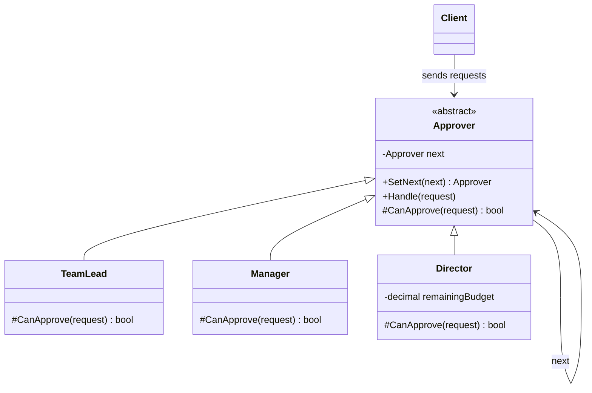

# ⛓️ Chain of Responsibility Pattern – Expense Approval Example (C#)

This example demonstrates the **Chain of Responsibility Pattern** in C#.  
In a company, an expense request is approved by different people depending on the amount: the **team lead** up to 500 EUR, the **manager** up to 5,000 EUR, the **director** up to 20,000 EUR within the remaining annual budget. The request travels along the chain until someone can approve it.

---

## 💡 Intent

> Avoid coupling the sender of a request to its receiver by giving more than one object a chance to handle the request. Chain the receiving objects and pass the request along the chain until an object handles it.

Use it when a request can be handled by **one of several objects**, and which one depends on the request itself. The sender only knows the first link.

---

## 🧠 Key Concepts in This Example

| Role              | Class                            | Responsibility                                                     |
|-------------------|----------------------------------|--------------------------------------------------------------------|
| Handler           | `Approver`                       | Holds the next link and decides whether to handle or forward       |
| Concrete Handlers | `TeamLead`, `Manager`, `Director`| Each defines what it can approve (`CanApprove`)                    |
| Client            | `Program.cs`                     | Builds the chain and sends every request to the first link        |

---

## 🗺️ UML Diagram



Each approver holds a reference to the **next** one. `Handle()` lives in the base class: it asks `CanApprove()` and, if the answer is no, forwards the request to the next link.

---

## 🧪 Example Use Case

The chain is built once:

```
Team lead (≤ 500) → Manager (≤ 5,000) → Director (≤ 20,000 and within budget)
```

The `Director` is a good example of why each link is a class: it doesn't only have a higher limit, it also **keeps track of the annual budget** and reduces it at every approval. When a request is above everyone's authority, the last link rejects it.

---

## 📦 Example Execution

```csharp
var approvalChain = new TeamLead();
approvalChain
    .SetNext(new Manager())
    .SetNext(new Director(annualBudget: 30_000m));

foreach (var request in requests)
{
    Console.WriteLine($"{request.Employee} asks {request.Amount:0.00} EUR for '{request.Description}':");
    approvalChain.Handle(request);
    Console.WriteLine();
}
```

Output:

```
Anna asks 120.00 EUR for 'Train ticket to Rome':
  APPROVED by Team lead

Marco asks 2400.00 EUR for 'Developer laptop':
  Team lead: above my authority, forwarding
  APPROVED by Manager

Sara asks 18000.00 EUR for 'Team offsite':
  Team lead: above my authority, forwarding
  Manager: above my authority, forwarding
  Director: remaining budget 12000.00 EUR
  APPROVED by Director

Luca asks 15000.00 EUR for 'Conference sponsorship':
  Team lead: above my authority, forwarding
  Manager: above my authority, forwarding
  Director: cannot approve it and there is nobody above. REJECTED
```

Luca's request would be within the director's limit, but Sara's offsite has already used 18,000 of the 30,000 EUR budget.

## ✅ Benefits

| Feature                             | Benefit                                                        |
| ----------------------------------- | -------------------------------------------------------------- |
| 🔗 Sender decoupled from receiver    | The client doesn't know who will approve the request           |
| 🧩 One rule per class                | Each approver contains only its own approval logic             |
| 🔀 Chain configurable at runtime     | Links can be added, removed or reordered without changing them |
| 🧱 Supports Open/Closed Principle    | A new level (e.g. a CFO) is a new class plus one `SetNext()`   |

## ⚠️ Notes

- **A request may not be handled at all.** The chain must decide what happens at the end: here the last link rejects explicitly. Without it, a request could silently get lost.
- **The order of the links matters.** Putting the `Director` first would make it approve everything up to 20,000 EUR, consuming the budget for small expenses.
- **Two variants exist**: in the classic one, the first link that can handle the request stops the chain (like here). In the *pipeline* variant, every link does its part and passes it on. ASP.NET Core middlewares work this way: each one can act on the request and then call `next()`, or stop the pipeline (e.g. authentication returning 401).

## 🔄 Alternatives & Related Patterns

- **[Decorator](../../Structural/Decorator/README.md)** has a similar structure, but every layer *adds* behavior, while in a chain the goal is to *find who handles* the request.
- **Command** objects are often what travels along the chain.
- **[Composite](../../Structural/Composite/README.md)**: a child can pass a request to its parent, forming a chain up the tree (e.g. events bubbling up in a UI).
