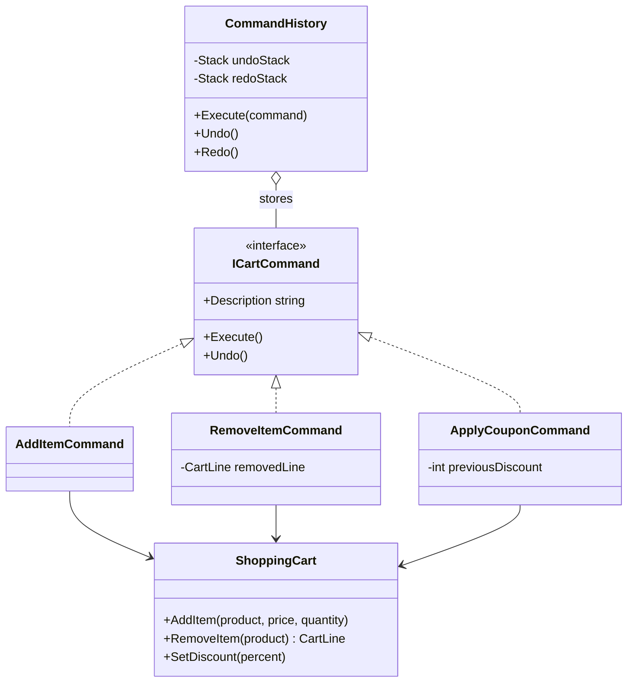

# 🕹️ Command Pattern – Shopping Cart with Undo/Redo Example (C#)

This example demonstrates the **Command Pattern** in C#.  
In a shopping cart, every user action (add a product, remove it, apply a coupon) becomes a **command object** that knows how to execute itself and how to undo itself. A history keeps the executed commands, so the user can **undo** and **redo** them.

---

## 💡 Intent

> Encapsulate a request as an object, thereby letting you parameterize clients with different requests, queue or log requests, and support undoable operations.

Use it when you need to treat operations as **data**: store them, undo them, replay them, queue them or log them.

---

## 🧠 Key Concepts in This Example

| Role              | Class                                                         | Responsibility                                               |
|-------------------|---------------------------------------------------------------|--------------------------------------------------------------|
| Command           | `ICartCommand`                                                | Declares `Execute()` and `Undo()`                            |
| Concrete Commands | `AddItemCommand`, `RemoveItemCommand`, `ApplyCouponCommand`   | Store the parameters and the state needed to undo            |
| Receiver          | `ShoppingCart`                                                | Does the real work: changes lines and discount               |
| Invoker           | `CommandHistory`                                              | Executes commands and manages the undo/redo stacks           |
| Client            | `Program.cs`                                                  | Creates the commands and passes them to the invoker          |

---

## 🗺️ UML Diagram



The invoker (`CommandHistory`) only knows `ICartCommand`. Each command knows its receiver (`ShoppingCart`) and what to call on it.

---

## 🧪 Example Use Case

Undoing an operation often needs information that only exists **at the moment of execution**, so each command saves it:

| Command              | `Execute()`                         | `Undo()`                                   |
|----------------------|-------------------------------------|--------------------------------------------|
| `AddItemCommand`     | adds N items                        | removes the same N items                   |
| `RemoveItemCommand`  | removes the line **and saves it**   | adds back the saved line (with its quantity) |
| `ApplyCouponCommand` | **saves the previous discount**, applies the new one | restores the previous discount |

The history uses two stacks: undo moves a command from the undo stack to the redo stack, redo moves it back. A **new action clears the redo stack**, as in any editor.

---

## 📦 Example Execution

```csharp
var cart = new ShoppingCart();
var history = new CommandHistory();

history.Execute(new AddItemCommand(cart, "Laptop", 899.00m, 1));
history.Execute(new AddItemCommand(cart, "Mouse", 25.00m, 2));
history.Execute(new ApplyCouponCommand(cart, "WELCOME10", 10));
history.Execute(new RemoveItemCommand(cart, "Mouse"));

history.Undo();
history.Undo();
history.Redo();

history.Execute(new AddItemCommand(cart, "USB-C cable", 12.90m, 1));
history.Redo();
```

Output (the cart after each step):

```
Do:   Add 1 x Laptop
      [Laptop x1 | total 899.00 EUR]
Do:   Add 2 x Mouse
      [Laptop x1, Mouse x2 | total 949.00 EUR]
Do:   Apply coupon WELCOME10 (-10%)
      [Laptop x1, Mouse x2 | -10% | total 854.10 EUR]
Do:   Remove Mouse
      [Laptop x1 | -10% | total 809.10 EUR]

Undo: Remove Mouse
      [Laptop x1, Mouse x2 | -10% | total 854.10 EUR]
Undo: Apply coupon WELCOME10 (-10%)
      [Laptop x1, Mouse x2 | total 949.00 EUR]
Redo: Apply coupon WELCOME10 (-10%)
      [Laptop x1, Mouse x2 | -10% | total 854.10 EUR]

Do:   Add 1 x USB-C cable
      [Laptop x1, Mouse x2, USB-C cable x1 | -10% | total 865.71 EUR]
Nothing to redo
      [Laptop x1, Mouse x2, USB-C cable x1 | -10% | total 865.71 EUR]
```

Undoing "Remove Mouse" brings back **both** mice, because the command saved the removed line. The last `Redo()` does nothing: adding the cable cleared the redo stack.

## ✅ Benefits

| Feature                          | Benefit                                                           |
| -------------------------------- | ----------------------------------------------------------------- |
| ↩️ Undo / redo                    | Each command knows how to reverse itself                          |
| 🔗 Invoker decoupled from actions | `CommandHistory` works with any command, present or future        |
| 📦 Operations as data             | Commands can be stored, logged, queued or sent somewhere else     |
| 🧱 Supports Open/Closed Principle | A new action (e.g. change quantity) is a new class                |

## ⚠️ Notes

- **Undo must be precise.** `ApplyCouponCommand` restores the *previous* discount, not zero: if a coupon was already applied, setting the discount to zero would be wrong.
- **Commands in .NET**: WPF and MAUI use the `ICommand` interface to bind buttons to actions, and libraries like MediatR model application requests (*CQRS commands*) as objects handled by a handler. They're the same idea, without undo.
- **Command vs Memento for undo**: commands undo by *reversing the operation*, which is cheap but must be written for every command. Memento undoes by *restoring a saved snapshot*, which is simpler but can use more memory.

## 🔄 Alternatives & Related Patterns

- **Memento** is the alternative way to implement undo (see the notes above).
- **[Chain of Responsibility](../ChainOfResponsibility/README.md)**: commands are often the requests that travel along a chain.
- **[Composite](../../Structural/Composite/README.md)**: a *macro command* is a composite of commands executed (and undone) together.
- **[Prototype](../../Creational/Prototype/README.md)** can be used to copy commands before storing them in the history.
