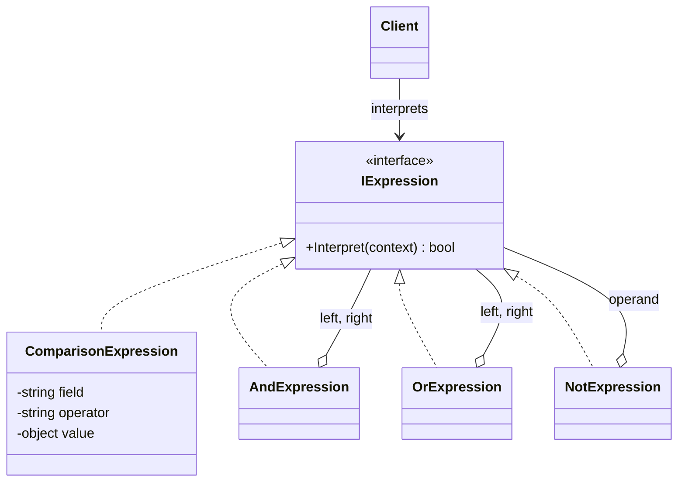

# 🗣️ Interpreter Pattern – Promotion Rules Example (C#)

This example demonstrates the **Interpreter Pattern** in C#.  
The marketing team defines promotions with **rules written as text**, like `country = 'IT' AND total >= 50`, without asking developers to change the code. Each rule becomes a **tree of expression objects**, and every node knows how to evaluate itself against an order.

---

## 💡 Intent

> Given a language, define a representation for its grammar along with an interpreter that uses the representation to interpret sentences in the language.

Use it when you have a **small, simple language** (business rules, filters, search queries) and want to evaluate its sentences at runtime.

---

## 🧠 Key Concepts in This Example

| Role                    | Class                                         | Responsibility                                               |
|-------------------------|-----------------------------------------------|--------------------------------------------------------------|
| Abstract Expression     | `IExpression`                                 | Declares `Interpret(context)`                                |
| Terminal Expression     | `ComparisonExpression`                        | A leaf: compares one field with a value (`total >= 50`)      |
| Nonterminal Expressions | `AndExpression`, `OrExpression`, `NotExpression` | Combine other expressions and interpret them recursively  |
| Context                 | `OrderContext`                                | The order data the rules are evaluated against               |
| Client                  | `Program.cs`                                  | Builds the trees (through the parser) and interprets them    |

`RuleParser` turns text into a tree. It's needed in practice, but **it's not part of the pattern**: the pattern describes how the tree is represented and evaluated, not how it's built.

---

## 🗺️ UML Diagram



`Interpret(context)` receives an `OrderContext` with the order data. Nonterminal expressions contain other `IExpression` objects: that's what makes the structure a tree (it's a [Composite](../../Structural/Composite/README.md)). `Interpret()` goes down to the leaves and combines their results on the way back up.

---

## 🧪 Example Use Case

The rule `isMember = true AND (items >= 3 OR total > 200)` becomes this tree:

```
                 AND
               /     \
  isMember = true     OR
                    /    \
           items >= 3    total > 200
```

To interpret it for an order, `AndExpression` asks its children: the left leaf checks `isMember`, the `OrExpression` asks its own two leaves. The rules are **parsed once** and then interpreted for every order.

The grammar, from lowest to highest precedence:

```
or         := and ( OR and )*
and        := not ( AND not )*
not        := NOT not | '(' or ')' | comparison
comparison := field operator value
```

---

## 📦 Example Execution

```csharp
var parsedRules = promotions
    .Select(promotion => (promotion.Name, Expression: RuleParser.Parse(promotion.Rule)))
    .ToList();

foreach (var (description, context) in orders)
{
    var applied = parsedRules.Where(rule => rule.Expression.Interpret(context)).Select(rule => rule.Name);
    Console.WriteLine($"  Promotions: {string.Join(", ", applied)}");
}
```

Output:

```
Parsed rules:
  Free shipping in Italy: (country = 'IT' AND total >= 50)
  Members deal: (isMember = true AND (items >= 3 OR total > 200))
  Welcome coupon: (NOT isMember = true AND total >= 100)

Order #1 (IT, 79.90 EUR, 2 items, guest)
  Promotions: Free shipping in Italy

Order #2 (DE, 249.00 EUR, 1 item, member)
  Promotions: Members deal

Order #3 (FR, 120.00 EUR, 4 items, guest)
  Promotions: Welcome coupon

Invalid rule: 'AND' is not a valid value.
```

The parsed rules are printed with explicit parentheses, which shows how the parser grouped them. Order #2 gets the members deal through the `OR` branch: it has only one item, but its total is above 200.

## ✅ Benefits

| Feature                           | Benefit                                                           |
| --------------------------------- | ----------------------------------------------------------------- |
| ✍️ Rules as data                   | New promotions are written as text, without recompiling          |
| 🧩 One class per grammar rule      | Each expression is small and easy to test                         |
| ➕ Easy to extend the language     | A new operator (e.g. `IN`) is a new expression class              |
| ♻️ Parse once, evaluate many times | The tree is reused for every order                                |

## ⚠️ Notes

- **Only for simple languages.** With a big grammar you'd end up with dozens of classes. For complex languages use a parser generator (e.g. ANTLR) or an existing engine.
- **.NET has its own interpreter**: `System.Linq.Expressions` represents code as a tree of `Expression` nodes. Entity Framework *interprets* those trees to translate LINQ queries into SQL.
- **Security**: evaluating rules written by users is safe here because the language can only compare fields. Never solve the same problem by evaluating arbitrary code (e.g. compiling C# scripts entered by users).

## 🔄 Alternatives & Related Patterns

- **[Composite](../../Structural/Composite/README.md)**: the expression tree *is* a composite, with terminal expressions as leaves.
- **Visitor** can add new operations to the tree (e.g. printing it, or translating it to SQL) without changing the expression classes.
- **[Flyweight](../../Structural/Flyweight/README.md)** can share identical terminal expressions between rules.
