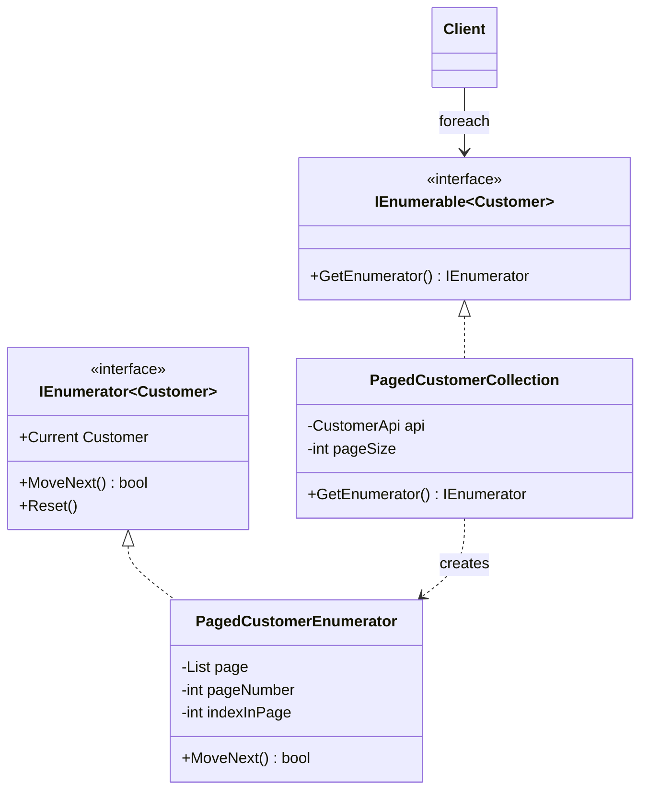

# 🔁 Iterator Pattern – Paged Customer API Example (C#)

This example demonstrates the **Iterator Pattern** in C#.  
A CRM API returns customers **one page at a time**. The `PagedCustomerCollection` lets the client write a simple `foreach` over all the customers, while the iterator fetches the next page from the API **only when it's needed**.

---

## 💡 Intent

> Provide a way to access the elements of an aggregate object sequentially without exposing its underlying representation.

Use it when clients should traverse a collection without knowing how it's stored or loaded: in memory, in pages from an API, from a file, from a database cursor...

---

## 🧠 Key Concepts in This Example

| Role               | Class / Interface           | Responsibility                                                 |
|--------------------|-----------------------------|----------------------------------------------------------------|
| Iterator           | `IEnumerator<T>`            | .NET interface: `MoveNext()`, `Current`, `Reset()`             |
| Concrete Iterator  | `PagedCustomerEnumerator`   | Tracks the position and loads pages on demand                  |
| Aggregate          | `IEnumerable<T>`            | .NET interface: `GetEnumerator()`                              |
| Concrete Aggregate | `PagedCustomerCollection`   | Creates a new iterator for every traversal                     |
| Client             | `Program.cs`                | Uses `foreach` and LINQ, unaware of the paging                 |

In C# the pattern is **built into the language**: `IEnumerable<T>` and `IEnumerator<T>` are the GoF roles, and `foreach` is the client code that drives the iterator.

---

## 🗺️ UML Diagram



The collection doesn't keep a position: each call to `GetEnumerator()` creates a **new iterator** with its own state. That's why the three traversals in the demo are independent.

---

## 🧪 Example Use Case

`MoveNext()` decides when to call the API:

1. If the current page still has customers, move to the next one: **no API call**.
2. If the page is finished and it was the last one, stop.
3. Otherwise, **fetch the next page**. A page shorter than the page size means it's the last one.

Because the iterator is lazy, LINQ operators that stop early (`Take`, `First`, `Any`) load only the pages they need.

---

## 📦 Example Execution

```csharp
var customers = new PagedCustomerCollection(new CustomerApi(), pageSize: 10);

foreach (var customer in customers.Take(3))
    Console.WriteLine($"  #{customer.Id} {customer.Name} ({customer.City})");

var fromTorino = customers.First(customer => customer.City == "Torino");

Console.WriteLine($"  Total: {customers.Count()}");
```

Output:

```
First 3 customers:
    [API] GET /customers?page=1&size=10
  #1 Customer 01 (Roma)
  #2 Customer 02 (Napoli)
  #3 Customer 03 (Bologna)

First customer in Torino:
    [API] GET /customers?page=1&size=10
    [API] GET /customers?page=2&size=10
  #14 Customer 14

Counting all customers:
    [API] GET /customers?page=1&size=10
    [API] GET /customers?page=2&size=10
    [API] GET /customers?page=3&size=10
  Total: 23
```

| Operation           | Pages loaded | Why                                         |
|---------------------|--------------|---------------------------------------------|
| `Take(3)`           | 1            | The first 3 customers are on page 1         |
| `First(Torino)`     | 2            | Customer #14 is on page 2, then it stops    |
| `Count()`           | 3            | It needs every customer                     |

## ✅ Benefits

| Feature                          | Benefit                                                           |
| -------------------------------- | ----------------------------------------------------------------- |
| 🙈 Hides the data source          | The client doesn't know about pages, URLs or page sizes           |
| ⏳ Lazy loading                   | Pages are fetched only when the traversal reaches them            |
| 🔀 Independent traversals         | Every `foreach` has its own iterator and position                 |
| 🔗 Works with LINQ                | Implementing `IEnumerable<T>` gives `Where`, `First`, `Take`... for free |

## ⚠️ Notes

- **`yield return` writes the iterator for you.** The whole `PagedCustomerEnumerator` class could be replaced by a method like this, and the compiler would generate an equivalent class:
  ```csharp
  public IEnumerator<Customer> GetEnumerator()
  {
      for (var pageNumber = 1; ; pageNumber++)
      {
          var page = _api.GetPage(pageNumber, _pageSize);
          foreach (var customer in page)
              yield return customer;
          if (page.Count < _pageSize)
              yield break;
      }
  }
  ```
  The explicit class in this example shows what the pattern looks like; in real code `yield return` is the idiomatic choice.
- **Real APIs are asynchronous.** With `HttpClient` you'd use `IAsyncEnumerable<T>`, `yield return` in an `async` method and `await foreach` in the client: same pattern, without blocking threads.
- **Don't modify a collection while iterating it.** .NET collections like `List<T>` throw `InvalidOperationException` if they're changed during a `foreach`, because the iterator's position would no longer be reliable.

## 🔄 Alternatives & Related Patterns

- **[Composite](../../Structural/Composite/README.md)**: iterators are often used to traverse composite trees.
- **[Factory Method](../../Creational/FactoryMethod/README.md)**: `GetEnumerator()` is a factory method that lets each collection create its own iterator.
- **Memento** can save the iterator's position to resume a traversal later.
