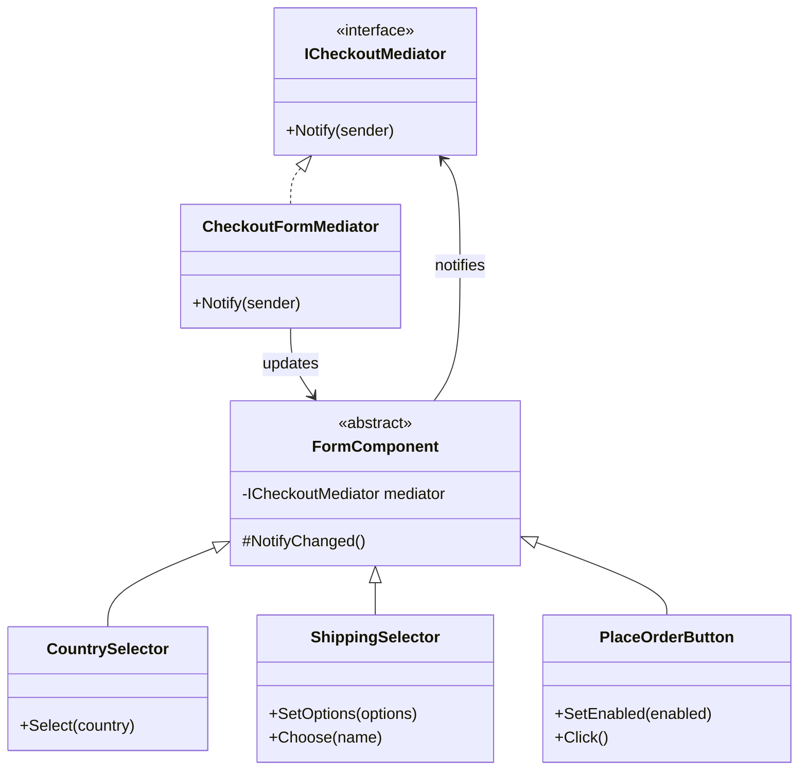

# 🧭 Mediator Pattern – Checkout Form Example (C#)

This example demonstrates the **Mediator Pattern** in C#.  
A checkout page has several components: country selector, shipping options, coupon field, terms checkbox, order summary and "Place order" button. Changing one affects the others (the country changes the shipping options, which change the total...). Instead of connecting every component to every other, they all talk to a **mediator**, which contains the rules.

---

## 💡 Intent

> Define an object that encapsulates how a set of objects interact. Mediator promotes loose coupling by keeping objects from referring to each other explicitly, and it lets you vary their interaction independently.

Use it when many objects interact in complex ways and the connections between them would turn into a tangle of references.

---

## 🧠 Key Concepts in This Example

| Role               | Class                                   | Responsibility                                                      |
|--------------------|-----------------------------------------|---------------------------------------------------------------------|
| Mediator           | `ICheckoutMediator`                     | Declares `Notify(sender)`                                           |
| Concrete Mediator  | `CheckoutFormMediator`                  | Knows all the components and the rules between them                 |
| Colleague          | `FormComponent`                         | Base class: knows only the mediator and notifies it of changes      |
| Concrete Colleagues| `CountrySelector`, `ShippingSelector`, `CouponField`, `TermsCheckbox`, `OrderSummary`, `PlaceOrderButton` | Do their own job and report changes |
| Client             | `Program.cs`                            | Creates the components and simulates the user                       |

---

## 🗺️ UML Diagram



`CouponField`, `TermsCheckbox` and `OrderSummary` are omitted from the diagram: they work exactly like the components shown. Components only point to the mediator; the mediator points to the components. There are **no arrows between components**.

---

## 🧪 Example Use Case

Without a mediator, the components would need to know each other:

```
CountrySelector → ShippingSelector → OrderSummary
CouponField ────────────────────────↗
TermsCheckbox → PlaceOrderButton ← ShippingSelector, CountrySelector...
```

With the mediator, every rule is in `CheckoutFormMediator.Notify()`:

- **country changed** → load domestic or international shipping options
- **coupon changed** → validate it and compute the discount
- **any change** → update the summary, enable the button only if country, shipping and terms are set
- **button clicked** → place the order

The components stay simple and reusable: a `CouponField` could be used in a different form with a different mediator.

---

## 📦 Example Execution

```csharp
_ = new CheckoutFormMediator(120.00m, country, shipping, coupon, terms, summary, button);

country.Select("IT");
shipping.Choose("Express");
coupon.Enter("WELCOME");
coupon.Enter("SAVE10");
button.Click();
terms.Toggle();
country.Select("DE");
button.Click();
```

Output (indented lines are the reactions coordinated by the mediator):

```
[Country] User selected IT
  [Shipping] Options updated: Standard 4.90, Express 9.90, Store pickup 0.00 (selected: Standard)
  [Summary] 120.00 - 0.00 discount + 4.90 shipping = 124.90 EUR
[Shipping] User chose Express
  [Summary] 120.00 - 0.00 discount + 9.90 shipping = 129.90 EUR
[Coupon] User entered WELCOME
  [Coupon] 'WELCOME' is not valid
  [Summary] 120.00 - 0.00 discount + 9.90 shipping = 129.90 EUR
[Coupon] User entered SAVE10
  [Coupon] SAVE10 is valid: -10%
  [Summary] 120.00 - 12.00 discount + 9.90 shipping = 117.90 EUR
[Button] User clicked 'Place order'
  [Button] Ignored: the button is disabled
[Terms] User accepted the terms
  [Summary] 120.00 - 12.00 discount + 9.90 shipping = 117.90 EUR
  [Button] Enabled
[Country] User selected DE
  [Shipping] Options updated: Standard 14.90, Express 29.90 (selected: Standard)
  [Summary] 120.00 - 12.00 discount + 14.90 shipping = 122.90 EUR
[Button] User clicked 'Place order'
  Order placed: 122.90 EUR, Standard shipping to DE
```

Switching to Germany replaces the shipping options and resets the selection, and the total follows, all without `CountrySelector` knowing that the other components exist.

## ✅ Benefits

| Feature                           | Benefit                                                          |
| --------------------------------- | ---------------------------------------------------------------- |
| 🔗 Loose coupling                  | Components don't reference each other                            |
| 📍 Interaction rules in one place  | The behavior of the whole form is readable in a single class     |
| ♻️ Reusable components             | The same component can be used with a different mediator        |
| 🧪 Easier testing                  | Components can be tested with a fake mediator                    |

## ⚠️ Notes

- **Beware of the "god object".** The mediator tends to grow with every new rule. If it becomes too big, split it by area (e.g. one mediator for pricing, one for validation).
- **MediatR is a different thing.** The popular .NET library is named after this pattern, but it's mainly used to dispatch requests (commands and queries) to their handlers. It decouples senders from handlers, but it doesn't coordinate a group of colleagues like the GoF mediator.
- In UI frameworks the same idea often appears as a **view model** (MVVM) or a **controller** that coordinates the widgets of a page.

## 🔄 Alternatives & Related Patterns

- **[Facade](../../Structural/Facade/README.md)** also centralizes things, but its subsystems don't know the facade; here the components actively notify the mediator.
- **Observer** is often used to implement the notifications from the components to the mediator (e.g. with C# events).
- **[Chain of Responsibility](../ChainOfResponsibility/README.md)** passes a request along a line of handlers; a mediator routes it through a central hub.
