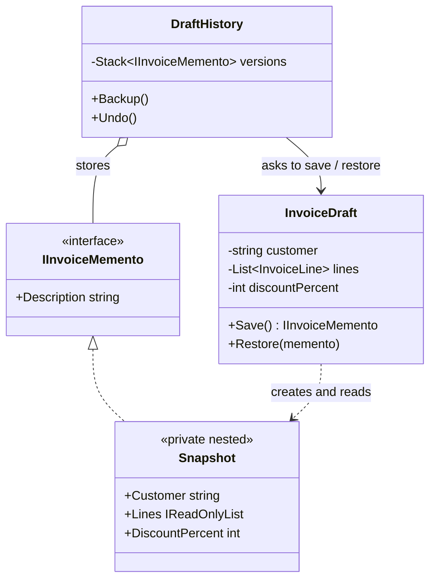

# 💾 Memento Pattern – Invoice Draft Versions Example (C#)

This example demonstrates the **Memento Pattern** in C#.  
An invoice editor lets the user save **versions** of a draft and go back to them. The draft creates a **snapshot** of its own state; the history stores the snapshots but **can't look inside them**, so the draft's data stays encapsulated.

---

## 💡 Intent

> Without violating encapsulation, capture and externalize an object's internal state so that the object can be restored to this state later.

Use it when you need undo, checkpoints or versions, and the object's state is private: you don't want to expose all its fields just so that someone else can save them.

---

## 🧠 Key Concepts in This Example

| Role       | Class                         | Responsibility                                                     |
|------------|-------------------------------|--------------------------------------------------------------------|
| Originator | `InvoiceDraft`                | Creates snapshots of its state (`Save`) and restores them (`Restore`) |
| Memento    | `InvoiceDraft.Snapshot`       | Private nested class holding the saved state, immutable            |
| Memento (narrow interface) | `IInvoiceMemento` | What the outside world sees: only a description              |
| Caretaker  | `DraftHistory`                | Decides when to save and restore, keeps the mementos in a stack    |
| Client     | `Program.cs`                  | Edits the draft and asks the history to save or undo               |

---

## 🗺️ UML Diagram



The caretaker holds `IInvoiceMemento` objects but only sees their `Description`. The real state lives in `Snapshot`, a **private nested class** of `InvoiceDraft`: no other class can even name the type, let alone read its fields.

---

## 🧪 Example Use Case

Encapsulation is protected by two C# features:

- **Private nested class**: `Snapshot` is declared `private` inside `InvoiceDraft`, so only the draft can create it and read its properties.
- **Narrow interface**: outside the draft, a snapshot is just an `IInvoiceMemento` with a `Description`, enough for the caretaker to show a version list.

The snapshot also **copies the list of lines**. If it kept a reference to the draft's own list, adding a line after saving would change the saved version too (the same shallow-copy problem described in [Prototype](../../Creational/Prototype/README.md)).

---

## 📦 Example Execution

```csharp
var draft = new InvoiceDraft();
var history = new DraftHistory(draft);

draft.SetCustomer("ACME Corp");
draft.AddLine("Consulting - 10 hours", 800.00m);
history.Backup();

draft.AddLine("Travel expenses", 150.00m);
history.Backup();

draft.SetDiscount(5);
draft.SetCustomer("ACME Corporation S.p.A.");

history.Undo();
history.Undo();
history.Undo();
```

Output:

```
Editing:
  [History] Saved version 1: ACME Corp, 1 line(s), discount 0%
  [History] Saved version 2: ACME Corp, 2 line(s), discount 0%
  Current: ACME Corporation S.p.A.: Consulting - 10 hours 800.00; Travel expenses 150.00 | -5% | total 902.50 EUR

Undoing:
  [History] Restored version 2: ACME Corp, 2 line(s), discount 0%
  Current: ACME Corp: Consulting - 10 hours 800.00; Travel expenses 150.00 | total 950.00 EUR
  [History] Restored version 1: ACME Corp, 1 line(s), discount 0%
  Current: ACME Corp: Consulting - 10 hours 800.00 | total 800.00 EUR
  [History] Nothing to restore
```

Restoring version 2 brings back the old customer name and removes the discount in one step, because the whole state is restored at once.

## ✅ Benefits

| Feature                          | Benefit                                                           |
| -------------------------------- | ----------------------------------------------------------------- |
| 🔒 Encapsulation preserved        | The draft's fields stay private; nobody else can read the snapshots |
| ↩️ Simple undo                    | Restoring a snapshot doesn't require knowing how each change works |
| 🧩 Separation of concerns         | The draft knows *what* to save, the history decides *when*        |

## ⚠️ Notes

- **Memory usage**: every snapshot is a full copy of the state. For large objects or frequent saves, limit the number of versions or save only the differences.
- **Memento vs Command for undo**: Memento restores a saved *state*, so it works for any change without extra code. [Command](../Command/README.md) *reverses each operation*, which uses less memory but requires an `Undo()` for every command. They are often combined: a command saves a memento before executing, and restores it to undo.
- **Immutable state makes it trivial.** With immutable types (e.g. `record` with `ImmutableList`), the current state object can itself be stored as the memento, because it can never change.
- **Persisted mementos**: when versions must survive a restart, mementos are serialized (e.g. to JSON). In that case the format becomes a contract: plan how to read old versions after the class changes.

## 🔄 Alternatives & Related Patterns

- **[Command](../Command/README.md)** is the alternative way to implement undo (see the notes above).
- **[Prototype](../../Creational/Prototype/README.md)** can be used to create the snapshot when the state is a complex object graph.
- **[Iterator](../Iterator/README.md)**: a memento can save an iterator's position to resume a traversal.
