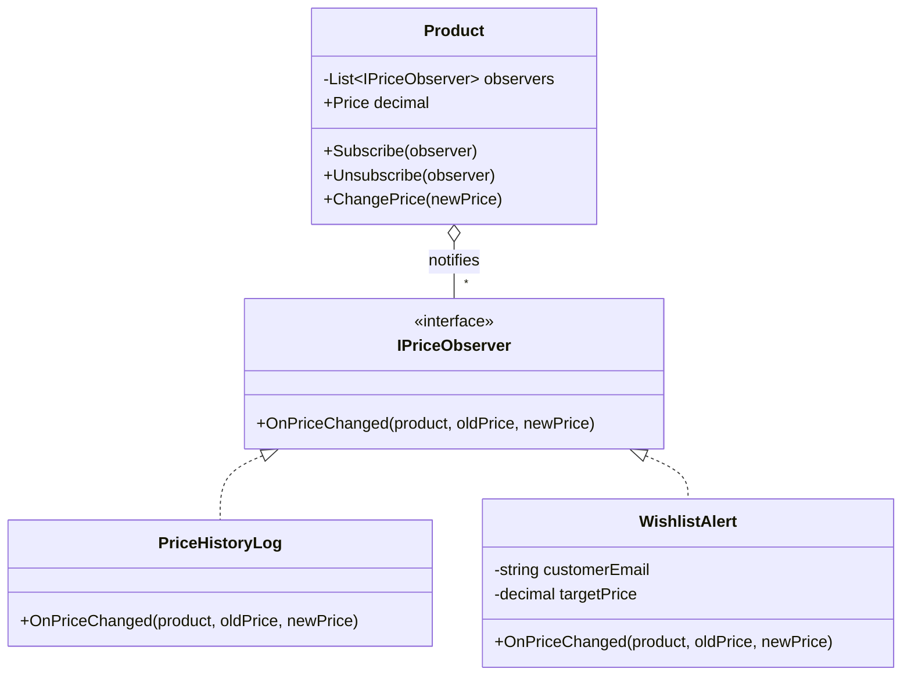

# 👀 Observer Pattern – Wishlist Price Alerts Example (C#)

This example demonstrates the **Observer Pattern** in C#.  
When the price of a product changes, several parts of an e-commerce need to know: the **price history** records every change, and the **wishlist alerts** email a customer when the price drops below their target. The product notifies its observers without knowing who they are or what they do.

---

## 💡 Intent

> Define a one-to-many dependency between objects so that when one object changes state, all its dependents are notified and updated automatically.

Use it when a change in one object must trigger reactions in others, and you don't want the object to depend on all of them. New reactions can be added by subscribing a new observer.

---

## 🧠 Key Concepts in This Example

| Role               | Class                             | Responsibility                                               |
|--------------------|-----------------------------------|--------------------------------------------------------------|
| Subject            | `Product`                         | Keeps the list of observers and notifies them on price change |
| Observer           | `IPriceObserver`                  | Declares `OnPriceChanged(product, oldPrice, newPrice)`       |
| Concrete Observers | `PriceHistoryLog`, `WishlistAlert`| React to the change, each in its own way                     |
| Client             | `Program.cs`                      | Subscribes the observers and changes the price               |

---

## 🗺️ UML Diagram



The subject depends only on the `IPriceObserver` interface. Observers can be added and removed at runtime, and the product never changes when a new kind of observer is introduced.

---

## 🧪 Example Use Case

Three observers are subscribed to the laptop:

| Observer                         | Reacts when                         | Then                         |
|----------------------------------|-------------------------------------|------------------------------|
| `PriceHistoryLog`                | every change                        | stays subscribed             |
| `WishlistAlert` (Anna, 800 EUR)  | the price is 800 EUR or less        | **unsubscribes itself**      |
| `WishlistAlert` (Marco, 850 EUR) | the price is 850 EUR or less        | **unsubscribes itself**      |

An observer that unsubscribes *while it's being notified* would change the list the subject is looping over. That's why `ChangePrice()` loops over a **copy** of the list (`_observers.ToList()`).

---

## 📦 Example Execution

```csharp
var laptop = new Product("Laptop", 899.00m);

laptop.Subscribe(new PriceHistoryLog());
laptop.Subscribe(new WishlistAlert("anna@example.com", targetPrice: 800.00m));
laptop.Subscribe(new WishlistAlert("marco@example.com", targetPrice: 850.00m));

laptop.ChangePrice(879.00m);
laptop.ChangePrice(849.00m);
laptop.ChangePrice(799.00m);
laptop.ChangePrice(799.00m);
laptop.ChangePrice(749.00m);
```

Output:

```
Laptop: price set to 879.00 EUR
  [History] Laptop: 899.00 -> 879.00 (-2.2%)
Laptop: price set to 849.00 EUR
  [History] Laptop: 879.00 -> 849.00 (-3.4%)
  [Email to marco@example.com] Laptop is now 849.00 EUR (your target: 850.00)
Laptop: price set to 799.00 EUR
  [History] Laptop: 849.00 -> 799.00 (-5.9%)
  [Email to anna@example.com] Laptop is now 799.00 EUR (your target: 800.00)
Laptop: price set to 799.00 EUR
  Same price, nobody is notified
Laptop: price set to 749.00 EUR
  [History] Laptop: 799.00 -> 749.00 (-6.3%)
```

Marco is notified at 849, Anna at 799, and neither of them again at 749: they had already unsubscribed. Setting the same price twice doesn't notify anyone.

## ✅ Benefits

| Feature                           | Benefit                                                          |
| --------------------------------- | ---------------------------------------------------------------- |
| 🔗 Loose coupling                  | The product doesn't know about emails, logs or charts            |
| ➕ New reactions without changes   | E.g. a "big discount" push notification is just a new observer   |
| 🔀 Dynamic subscriptions           | Observers come and go at runtime                                 |

## ⚠️ Notes

- **C# has the pattern built in.** The idiomatic version uses an `event`:
  ```csharp
  public event EventHandler<PriceChangedEventArgs>? PriceChanged;
  // subscribe:   laptop.PriceChanged += OnPriceChanged;
  // unsubscribe: laptop.PriceChanged -= OnPriceChanged;
  ```
  The interface version in this example makes the roles explicit; with events, the delegate list plays the role of the observer list. .NET also has `IObservable<T>` / `IObserver<T>`, used by Reactive Extensions (Rx).
- **Memory leaks**: the subject keeps a reference to every observer. An observer that never unsubscribes (or never removes its event handler) can't be garbage collected while the subject is alive. This is a common source of leaks, e.g. in long-lived UI pages.
- **Notification order isn't guaranteed by design**, and a slow or failing observer delays (or breaks) the others. For heavy work, observers should hand it off (e.g. put an email in a queue) instead of doing it during the notification.
- Across services, the same idea becomes **publish/subscribe** with a message broker (e.g. RabbitMQ, Azure Service Bus), where publishers and subscribers don't even know each other.

## 🔄 Alternatives & Related Patterns

- **[Mediator](../Mediator/README.md)** centralizes the reactions in one class; Observer spreads them across independent subscribers. Mediators are often implemented with observer notifications.
- **[Singleton](../../Creational/Singleton.Basic/README.md)**: an application-wide event bus is often a single shared instance.
- **State**: an object's state change is a typical event that observers react to.
