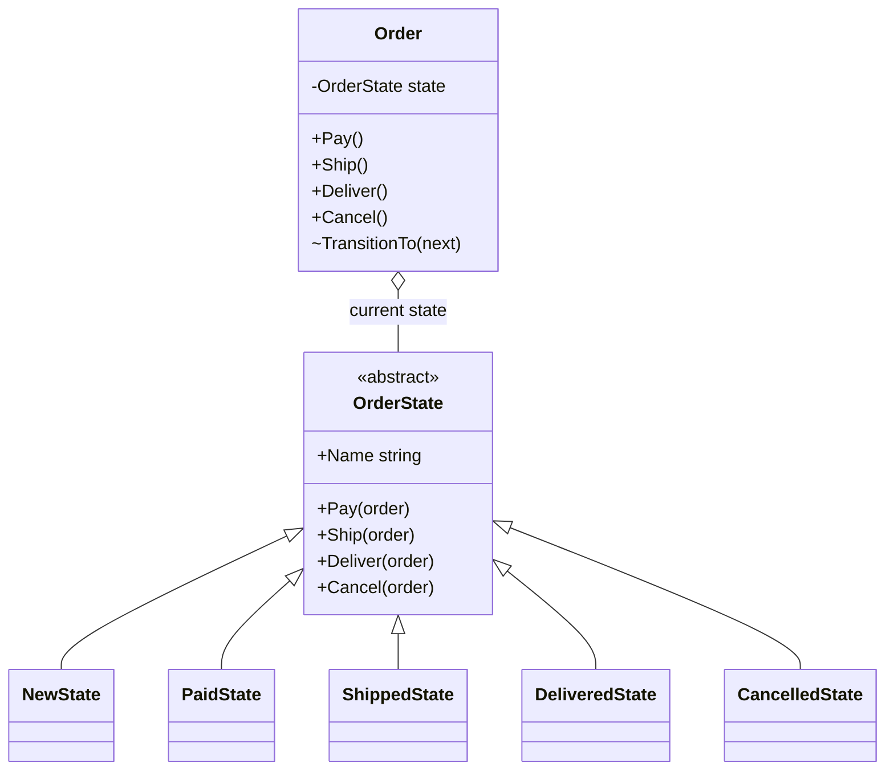
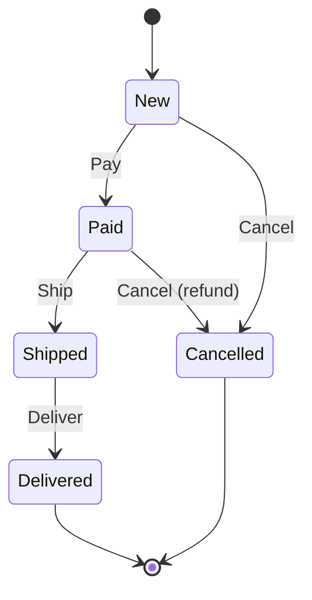

# 🚦 State Pattern – Order Lifecycle Example (C#)

This example demonstrates the **State Pattern** in C#.  
An order goes through several states: **New → Paid → Shipped → Delivered**, or **Cancelled**. What the order can do depends on its state: it can't be shipped before it's paid, and it can't be cancelled once it's on its way. Each state is a class that decides which actions are allowed and which state comes next.

---

## 💡 Intent

> Allow an object to alter its behavior when its internal state changes. The object will appear to change its class.

Use it when an object's behavior depends on its state and you find the same `switch (status)` repeated in many methods.

---

## 🧠 Key Concepts in This Example

| Role            | Class                                                              | Responsibility                                                  |
|-----------------|--------------------------------------------------------------------|-----------------------------------------------------------------|
| Context         | `Order`                                                            | Exposes the actions and delegates them to the current state     |
| State           | `OrderState`                                                       | Declares the actions; by default refuses all of them            |
| Concrete States | `NewState`, `PaidState`, `ShippedState`, `DeliveredState`, `CancelledState` | Allow some actions and decide the transitions         |
| Client          | `Program.cs`                                                       | Calls the actions on the order, without checking its state      |

---

## 🗺️ UML Diagram



`Order.Pay()` simply calls `_state.Pay(this)`. The state receives the order so it can call `TransitionTo()` and replace itself with the next state.

---

## 🧪 Example Use Case

The allowed transitions:



Each arrow is an override in a state class. Everything else falls back to `OrderState`, whose default implementation **refuses** the action. That's why `DeliveredState` and `CancelledState` contain only their name: in a final state, nothing is allowed.

Without the pattern, every method of `Order` would look like this, and adding a state (e.g. *Returned*) would mean changing all of them:

```csharp
public void Cancel()
{
    switch (Status)
    {
        case "New": Status = "Cancelled"; break;
        case "Paid": Refund(); Status = "Cancelled"; break;
        case "Shipped": Console.WriteLine("Request a return"); break;
        default: Console.WriteLine("Cannot cancel"); break;
    }
}
```

---

## 📦 Example Execution

```csharp
var first = new Order("ORD-1");
first.Ship();
first.Pay();
first.Ship();
first.Cancel();
first.Deliver();
first.Pay();

var second = new Order("ORD-2");
second.Pay();
second.Cancel();
second.Ship();
```

Output:

```
ORD-1 (from new to delivered):
  Cannot ship ORD-1: it's New (it must be paid first)
  ORD-1: New -> Paid
  ORD-1: Paid -> Shipped
  Cannot cancel ORD-1: it's Shipped (already on its way, request a return instead)
  ORD-1: Shipped -> Delivered
  Cannot pay ORD-1: it's Delivered
  Final status: Delivered

ORD-2 (cancelled after payment):
  ORD-2: New -> Paid
  Refunding the payment of ORD-2
  ORD-2: Paid -> Cancelled
  Cannot ship ORD-2: it's Cancelled
  Final status: Cancelled
```

The same call (`Cancel()`) cancels a new order, refunds a paid one and is refused for a shipped one.

## ✅ Benefits

| Feature                             | Benefit                                                         |
| ----------------------------------- | --------------------------------------------------------------- |
| 🧹 No repeated switches              | The behavior of each state is in one class                      |
| 🔒 Invalid transitions are impossible| Only the overridden actions can change the state                |
| ➕ Easy to add states                | A new state is a new class, plus the transitions that lead to it |
| 📖 Readable rules                    | Reading `PaidState` tells you everything a paid order can do    |

## ⚠️ Notes

- **Who decides the transitions?** Here the states do (`order.TransitionTo(new PaidState())`), so the rules are spread across the state classes. Alternatively the context can decide, keeping all the transitions in one place but making the context bigger.
- **Stateless states can be shared.** These state classes have no fields, so a single instance of each could be reused (e.g. `static readonly`) instead of creating new ones at each transition.
- **For simple cases, a switch is fine.** With two or three states and few actions, a `switch` expression on an `enum` is shorter and perfectly readable. The pattern pays off when states and actions grow. For complex workflows, libraries like **Stateless** offer a declarative way to configure state machines.
- **Persistence**: in a database the state is usually saved as a value (e.g. a `Status` column). When the order is loaded, the right state object is recreated from that value.

## 🔄 Alternatives & Related Patterns

- **Strategy** has the same structure (the context delegates to an interchangeable object), but strategies are chosen *from outside* and don't know each other, while states *replace themselves* and know which state comes next.
- **[Observer](../Observer/README.md)**: state transitions are typical events to notify (e.g. email the customer when the order is shipped).
- **[Singleton](../../Creational/Singleton.Basic/README.md)** or **[Flyweight](../../Structural/Flyweight/README.md)** can be used to share stateless state objects.
