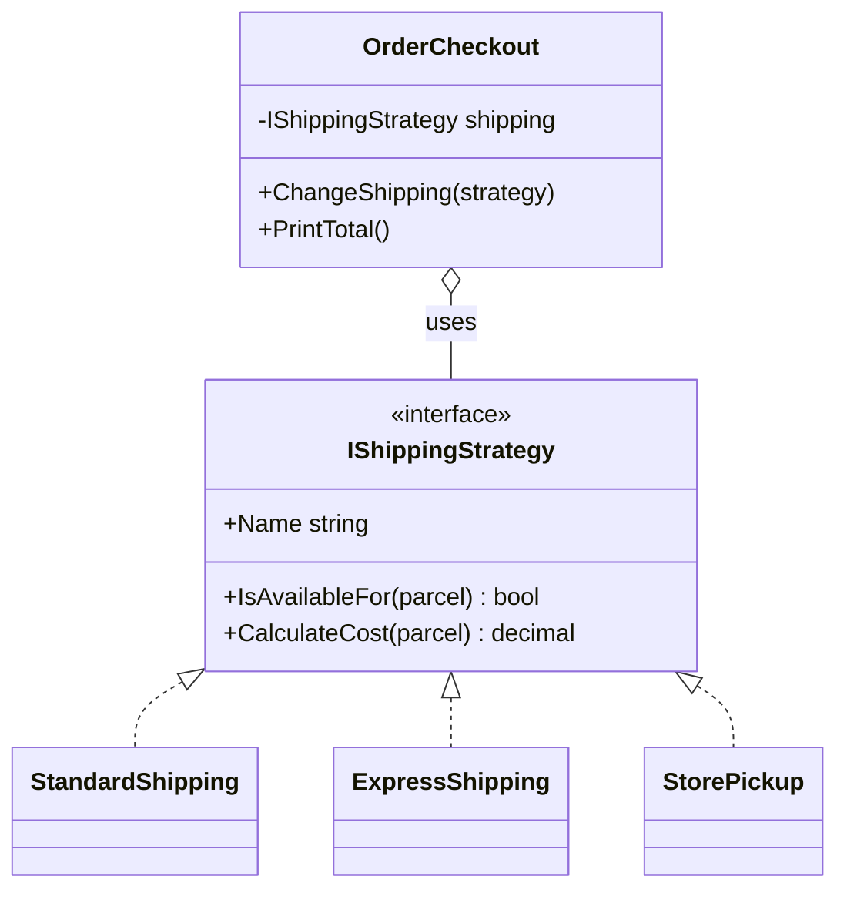

# ♟️ Strategy Pattern – Shipping Cost Example (C#)

This example demonstrates the **Strategy Pattern** in C#.  
An e-commerce offers several shipping methods, each with its own pricing rules: **Standard** (free in Italy above 50 EUR), **Express** (priced by weight, doubled abroad) and **Store pickup** (free, only in Italy). Each method is a strategy, and the checkout uses whichever the customer picks.

---

## 💡 Intent

> Define a family of algorithms, encapsulate each one, and make them interchangeable. Strategy lets the algorithm vary independently from clients that use it.

Use it when the same task (here: pricing a shipment) can be done in different ways, and you'd otherwise write a growing `if/else` or `switch` to choose between them.

---

## 🧠 Key Concepts in This Example

| Role                | Class                                                   | Responsibility                                       |
|---------------------|---------------------------------------------------------|------------------------------------------------------|
| Strategy            | `IShippingStrategy`                                     | Declares `IsAvailableFor()` and `CalculateCost()`    |
| Concrete Strategies | `StandardShipping`, `ExpressShipping`, `StorePickup`    | Each implements its own pricing rules                |
| Context             | `OrderCheckout`                                         | Uses the current strategy to compute the order total |
| Client              | `Program.cs`                                            | Chooses the strategy and can change it at runtime    |

---

## 🗺️ UML Diagram



The context holds a reference to the interface. Changing strategy means replacing that reference: `OrderCheckout` never changes.

---

## 🧪 Example Use Case

The rules of each strategy:

| Strategy       | Italy                                           | Abroad                              | Available |
|----------------|-------------------------------------------------|-------------------------------------|-----------|
| `Standard`     | 4.90 + 1.00/kg above 2 kg, **free from 50 EUR** | 12.90 + 2.00/kg above 2 kg          | always    |
| `Express`      | 9.90 + 1.50/kg                                  | (9.90 + 1.50/kg) × 2                | always    |
| `Store pickup` | free                                            | —                                   | Italy, up to 20 kg |

Without the pattern, all these rules would end up in one method with a `switch` on the shipping method and nested `if`s on country and weight. With the pattern, each row of the table is a small class that can be tested on its own.

---

## 📦 Example Execution

```csharp
IShippingStrategy[] strategies = [new StandardShipping(), new ExpressShipping(), new StorePickup()];

foreach (var strategy in strategies)
    Console.WriteLine($"  {strategy.Name,-13} {strategy.CalculateCost(parcel):0.00} EUR");

var checkout = new OrderCheckout(parcelToGermany, new StandardShipping());
checkout.PrintTotal();

checkout.ChangeShipping(new ExpressShipping());
checkout.PrintTotal();

checkout.ChangeShipping(new StorePickup());
checkout.PrintTotal();
```

Output:

```
Small order to Italy (1.5 kg, 39.90 EUR)
  Standard      4.90 EUR
  Express       12.15 EUR
  Store pickup  0.00 EUR

Heavy order to Italy (8 kg, 129.00 EUR)
  Standard      0.00 EUR
  Express       21.90 EUR
  Store pickup  0.00 EUR

Order to Germany (3 kg, 89.00 EUR)
  Standard      14.90 EUR
  Express       28.80 EUR
  Store pickup  not available

Checkout of the order to Germany:
  89.00 + 14.90 (Standard) = 103.90 EUR
  89.00 + 28.80 (Express) = 117.80 EUR
  Store pickup is not available for this order
  89.00 + 28.80 (Express) = 117.80 EUR
```

The same `CalculateCost()` call gives a different result depending on the strategy. When the customer picks a method that isn't available, the checkout keeps the previous one.

## ✅ Benefits

| Feature                           | Benefit                                                          |
| --------------------------------- | ---------------------------------------------------------------- |
| 🧹 No conditional logic            | No `switch` on the shipping method in the checkout               |
| 🔁 Swappable at runtime            | The customer can change method and the total follows             |
| 🧱 Supports Open/Closed Principle  | A new carrier (e.g. a locker service) is a new class             |
| 🧪 Easy to test                    | Each pricing rule is tested in isolation                         |

## ⚠️ Notes

- **With Dependency Injection** strategies are usually all registered and injected as `IEnumerable<IShippingStrategy>`, then selected by name or by `IsAvailableFor()`. This is exactly what the "options page" loop in the demo does.
- **A delegate can be a strategy.** For a single, simple algorithm, a `Func<Parcel, decimal>` is enough: LINQ's `OrderBy(x => x.Price)` takes the sorting key as a strategy. Use classes when a strategy has more than one method or its own dependencies.
- **Strategy vs State**: same structure, different intent. Strategies are chosen *from outside* and don't know each other; [states](../State/README.md) *switch themselves* and know which state comes next.

## 🔄 Alternatives & Related Patterns

- **[State](../State/README.md)** has the same structure but different intent (see the notes above).
- **[Bridge](../../Structural/Bridge/README.md)** also delegates to an interface, but to separate two hierarchies that both evolve, not to swap one algorithm.
- **Template Method** varies parts of an algorithm through *inheritance*; Strategy varies the whole algorithm through *composition*.
- **[Decorator](../../Structural/Decorator/README.md)** changes an object's behavior by wrapping it; Strategy changes it by replacing one of its parts.
