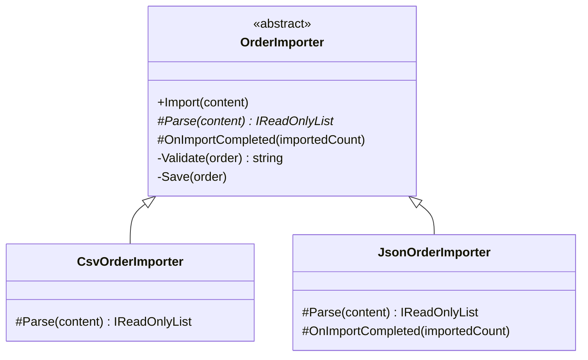

# 📋 Template Method Pattern – Order Import Example (C#)

This example demonstrates the **Template Method Pattern** in C#.  
An e-commerce imports orders from two sources: a **CSV file** exported by the accounting software and the **JSON** sent by a marketplace. The steps are always the same (read, validate, save, report), only the parsing changes. The base class defines the algorithm once; subclasses fill in the format-specific step.

---

## 💡 Intent

> Define the skeleton of an algorithm in an operation, deferring some steps to subclasses. Template Method lets subclasses redefine certain steps of an algorithm without changing the algorithm's structure.

Use it when several classes implement the same process with small differences, and you want to avoid duplicating the common steps (or letting each copy drift apart).

---

## 🧠 Key Concepts in This Example

| Role            | Class                                   | Responsibility                                                    |
|-----------------|-----------------------------------------|-------------------------------------------------------------------|
| Abstract Class  | `OrderImporter`                         | Defines `Import()`, the template method, and the shared steps     |
| Concrete Classes| `CsvOrderImporter`, `JsonOrderImporter` | Implement `Parse()` and, if needed, the `OnImportCompleted()` hook |
| Client          | `Program.cs`                            | Calls `Import()` without knowing the format                       |

The steps come in three kinds:

| Step                  | Kind                        | Who defines it                       |
|-----------------------|-----------------------------|--------------------------------------|
| `Import()`            | **template method**         | base class, not overridable          |
| `Parse()`             | **abstract step**           | every subclass must implement it     |
| `OnImportCompleted()` | **hook** (empty by default) | subclasses override it only if needed |
| `Validate()`, `Save()`| **shared steps**            | base class, private                  |

---

## 🗺️ UML Diagram



`Import()` calls the other methods in a fixed order. The abstract step, `Parse()`, is shown in italics. Only `JsonOrderImporter` overrides the hook, because only the marketplace needs a confirmation.

---

## 🧪 Example Use Case

The template method in the base class:

```csharp
public void Import(string content)
{
    var orders = Parse(content);          // abstract: depends on the format

    foreach (var order in orders)
    {
        var error = Validate(order);      // shared
        if (error is not null) { /* reject */ continue; }
        Save(order);                      // shared
    }

    OnImportCompleted(imported);          // hook: does nothing unless overridden
}
```

The validation rules are written **once**: a CSV order and a JSON order are rejected for the same reasons. Adding an XML source means writing only its `Parse()`.

---

## 📦 Example Execution

```csharp
OrderImporter[] importers = [new CsvOrderImporter(), new JsonOrderImporter()];
string[] contents = [csv, json];

for (var i = 0; i < importers.Length; i++)
    importers[i].Import(contents[i]);
```

Output:

```
Importing from CSV file:
  Saved A-100: ACME Corp, 250.00 EUR
  Rejected A-101: amount must be a positive number
  Saved A-102: Initech, 99.90 EUR
  Imported 2, rejected 1

Importing from marketplace JSON:
  Saved M-500: Umbrella Inc, 120.50 EUR
  Rejected order of Stark Industries: missing order id
  Imported 1, rejected 1
  [Marketplace] Sent confirmation for 1 order(s)
```

The CSV row with `abc` as amount and the JSON order without an id are rejected by the same shared validation. Only the JSON import ends with the marketplace confirmation, thanks to the hook.

## ✅ Benefits

| Feature                          | Benefit                                                           |
| -------------------------------- | ----------------------------------------------------------------- |
| ♻️ No duplicated steps            | Validation and saving are written once                            |
| 🔒 Fixed sequence                 | Subclasses can't skip validation or change the order of the steps |
| 🎯 Small subclasses               | Each importer contains only what is specific to its format        |
| 🪝 Optional extensions            | Hooks let a subclass add behavior without forcing the others      |

## ⚠️ Notes

- **Keep the template method non-virtual.** If `Import()` could be overridden, a subclass could skip the validation, defeating the purpose of the pattern.
- **It relies on inheritance**, which couples subclasses to the base class: a change in the base class affects all of them. When the variable parts grow, consider [Strategy](../Strategy/README.md) instead, e.g. passing an `IOrderParser` to a single importer class.
- **.NET examples**: `Stream` implements `CopyTo()` once on top of the abstract `Read()`/`Write()` of each stream type. In ASP.NET Core, `BackgroundService.StartAsync()` is the template and `ExecuteAsync()` is the step you implement.

## 🔄 Alternatives & Related Patterns

- **[Strategy](../Strategy/README.md)** varies the whole algorithm through *composition*; Template Method varies some steps through *inheritance*.
- **[Factory Method](../../Creational/FactoryMethod/README.md)** is often a step of a template method: the base class calls it to create an object, and subclasses decide which one.
- **[Builder](../../Creational/Builder/README.md)**: a director that always calls the same building steps in the same order is a similar idea applied to object construction.
