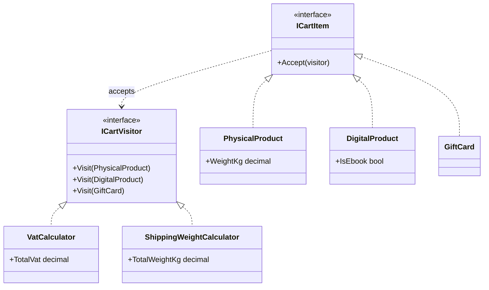

# 🧳 Visitor Pattern – Cart VAT and Shipping Example (C#)

This example demonstrates the **Visitor Pattern** in C#.  
A shopping cart contains different kinds of items: **physical products**, **digital products** and **gift cards**. Several operations treat each kind differently: VAT is 22% on goods, 4% on e-books and 0% on gift cards; only physical products have a shipping weight. Each operation is a **visitor**, so new operations can be added without touching the item classes.

---

## 💡 Intent

> Represent an operation to be performed on the elements of an object structure. Visitor lets you define a new operation without changing the classes of the elements on which it operates.

Use it when the set of **element types is stable** but you keep adding **new operations** on them, and you don't want to fill the element classes with unrelated logic (taxes, shipping, export, reports...).

---

## 🧠 Key Concepts in This Example

| Role              | Class                                         | Responsibility                                                    |
|-------------------|-----------------------------------------------|-------------------------------------------------------------------|
| Visitor           | `ICartVisitor`                                | One `Visit()` overload for each element type                      |
| Concrete Visitors | `VatCalculator`, `ShippingWeightCalculator`   | One operation each, with a different rule per element type        |
| Element           | `ICartItem`                                   | Declares `Accept(visitor)`                                        |
| Concrete Elements | `PhysicalProduct`, `DigitalProduct`, `GiftCard` | Implement `Accept()` by calling `visitor.Visit(this)`           |
| Client            | `Program.cs`                                  | Runs a visitor over all the items in the cart                     |

---

## 🗺️ UML Diagram



Two parallel hierarchies: the **elements** (what's in the cart) and the **visitors** (what we do with it). Adding an operation means adding a class to the visitor side only.

---

## 🧪 Example Use Case

The trick is called **double dispatch**: the operation that runs depends on *two* types, the visitor's and the element's.

```csharp
foreach (ICartItem item in cart)
    item.Accept(vat);          // 1st dispatch: which Accept()? Depends on the item's type

// inside PhysicalProduct:
public void Accept(ICartVisitor visitor) => visitor.Visit(this);
                               // 2nd dispatch: "this" is a PhysicalProduct,
                               // so Visit(PhysicalProduct) is called
```

The loop only knows `ICartItem`, yet each item ends up in the right `Visit()` overload, with no `if (item is GiftCard)` anywhere.

The rules of the two visitors:

| Item type         | `VatCalculator`                | `ShippingWeightCalculator`   |
|-------------------|--------------------------------|------------------------------|
| `PhysicalProduct` | 22%                            | adds its weight              |
| `DigitalProduct`  | 4% if e-book, otherwise 22%    | not shipped                  |
| `GiftCard`        | 0% (VAT applies when spent)    | not shipped (sent by email)  |

---

## 📦 Example Execution

```csharp
var vat = new VatCalculator();
foreach (var item in cart)
    item.Accept(vat);

var weight = new ShippingWeightCalculator();
foreach (var item in cart)
    item.Accept(weight);
```

Output:

```
VAT:
  Laptop                   899.00  VAT 22%   197.78
  Monitor                  179.90  VAT 22%    39.58
  C# Patterns (e-book)      39.90  VAT  4%     1.60
  Antivirus license         49.00  VAT 22%    10.78
  Gift card                 50.00  VAT  0%     0.00
  Total VAT: 249.74 EUR

Shipping weight:
  Laptop                 2.1 kg
  Monitor                5.4 kg
  C# Patterns (e-book)   download, not shipped
  Antivirus license      download, not shipped
  Gift card              sent by email, not shipped
  Total weight: 7.5 kg
```

The same cart is traversed twice by two different visitors. The item classes know nothing about VAT rates or shipping.

## ✅ Benefits

| Feature                             | Benefit                                                         |
| ----------------------------------- | --------------------------------------------------------------- |
| ➕ New operations without changes    | A "loyalty points" calculation is just a new visitor            |
| 🧩 Related logic stays together      | All the VAT rules are in `VatCalculator`, not spread across items |
| 🧹 Clean element classes             | Products contain only product data                              |
| 📊 State across elements             | A visitor can accumulate results (totals) while it visits       |

## ⚠️ Notes

- **The trade-off: new element types are expensive.** Adding a `Subscription` item means adding a `Visit(Subscription)` to the interface and to *every* visitor. Use Visitor when operations change often and element types rarely.
- **Pattern matching is the modern alternative in C#.** A `switch` expression on the type gives a similar result without `Accept()` methods:
  ```csharp
  decimal VatRate(ICartItem item) => item switch
  {
      PhysicalProduct => 0.22m,
      DigitalProduct { IsEbook: true } => 0.04m,
      DigitalProduct => 0.22m,
      GiftCard => 0m,
      _ => throw new NotSupportedException()
  };
  ```
  It's shorter, but the compiler doesn't tell you which switches to update when a new type is added. With the visitor interface, a missing `Visit()` is a compile error.
- **.NET examples**: Roslyn's `CSharpSyntaxVisitor` and LINQ's `ExpressionVisitor` let you walk syntax and expression trees with one method per node type.

## 🔄 Alternatives & Related Patterns

- **[Composite](../../Structural/Composite/README.md)**: visitors are often used to run operations over a whole composite tree.
- **[Interpreter](../Interpreter/README.md)**: a visitor can add operations to an expression tree (printing it, translating it to SQL) without changing the expression classes.
- **[Iterator](../Iterator/README.md)** traverses the structure; Visitor defines what to do with each element.
