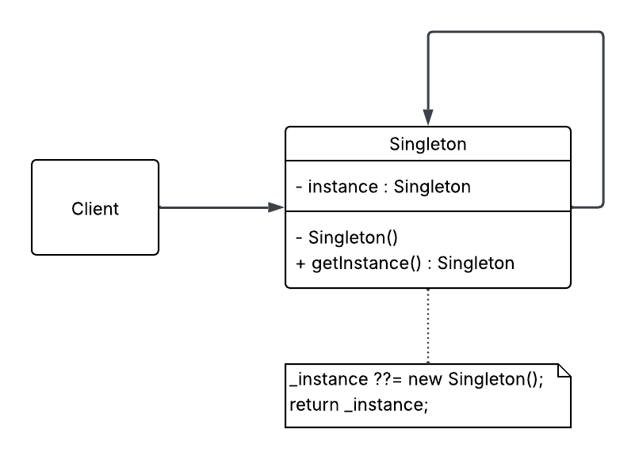

# 🧱 Singleton Pattern – Basic Version

The **Singleton Pattern** ensures that a class has only one instance and provides a global point of access to it.

This is the most basic (non-thread-safe) implementation. It's suitable when:

- You are in a single-threaded environment
- You want minimal overhead
- You understand the risks in multithreaded contexts

---

## 📦 Implementation Summary

**Singleton.cs**: 
```csharp
public class Singleton
{
    private static Singleton _instance;

    private Singleton() { }

    public static Singleton Instance
    {
        get
        {
            _instance ??= new Singleton();

            return _instance;
        }
    }

    public void DoWork() => Console.WriteLine("Working from singleton instance.");
}
```

**Program.cs**
```csharp
using SingletonBasic;

var s1 = Singleton.Instance;
var s2 = Singleton.Instance;

Console.WriteLine(ReferenceEquals(s1, s2) 
    ? "Same instance" 
    : "Different instances");

s1.DoWork();

Console.WriteLine("Press any key to exit...");
Console.ReadLine();
```

## 🧠 Use Cases

- Logging
- Configuration settings
- Database connections
- Caching
- Shared resources or coordination objects

## ⚠️ Trade-offs

| Pros                         | Cons                                                             |
|------------------------------|------------------------------------------------------------------|
| Simple and easy to implement | Not thread-safe                                                  |
| Ensures a single instance    | Harder to test and mock                                          |
| Global access point          | Can become a hidden dependency (anti-pattern if abused)         |

## 📐 UML Diagram



