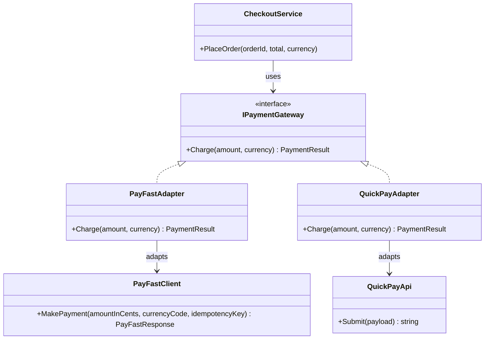

# 🔌 Adapter Pattern – Payment Gateways Example (C#)

This example demonstrates the **Adapter Pattern** in C#.  
An e-commerce checkout integrates **two third-party payment SDKs** (PayFast and QuickPay) whose APIs don't match the interface our application uses, and that we can't modify.

---

## 💡 Intent

> Convert the interface of a class into another interface clients expect. Adapter lets classes work together that couldn't otherwise because of incompatible interfaces.

Use it when you want to use an existing class (a third-party SDK, a legacy component) but its interface doesn't match the one your code depends on.
The adapter is the only place that knows the external API, so the rest of the application stays clean.

---

## 🧠 Key Concepts in This Example

| Role     | Class                               | Responsibility                                                 |
|----------|-------------------------------------|----------------------------------------------------------------|
| Target   | `IPaymentGateway`                   | The interface our application expects                          |
| Adaptee  | `PayFastClient`, `QuickPayApi`      | Third-party SDKs with incompatible APIs                        |
| Adapter  | `PayFastAdapter`, `QuickPayAdapter` | Implement the target and translate calls to the adaptee        |
| Client   | `CheckoutService`                   | Charges orders through `IPaymentGateway` only                  |

---

## 🗺️ UML Diagram



The client depends only on `IPaymentGateway`. Each adapter implements it and holds a reference to the third-party class it translates calls to (composition).

---

## 🧪 Example Use Case

Our checkout only knows this interface:

```csharp
PaymentResult Charge(decimal amount, string currency);
```

The two providers expose something completely different:

| Provider | API                                                                         | What the adapter does                                         |
|----------|-----------------------------------------------------------------------------|---------------------------------------------------------------|
| PayFast  | `MakePayment(long amountInCents, string currencyCode, string idempotencyKey)` returns a status code | Converts `decimal` to cents, generates the idempotency key, maps `200`/`402` to a `PaymentResult` |
| QuickPay | `Submit(string payload)` with `"AMOUNT=49.90;CUR=EUR"` returns `"OK\|QP-1001"` or `"KO\|reason"` | Builds the payload with `InvariantCulture`, parses the response string |

Note that an adapter is rarely a simple method rename: here it **converts units**, **formats data**, and **translates errors**.

---

## 📦 Example Execution

```csharp
var payFastCheckout = new CheckoutService(new PayFastAdapter(new PayFastClient()));
payFastCheckout.PlaceOrder("A-100", 49.90m, "EUR");
payFastCheckout.PlaceOrder("A-101", 1500.00m, "EUR");

var quickPayCheckout = new CheckoutService(new QuickPayAdapter(new QuickPayApi()));
quickPayCheckout.PlaceOrder("B-200", 49.90m, "EUR");
quickPayCheckout.PlaceOrder("B-201", 25.00m, "USD");
```

Output:

```
Checkout with PayFast:
Order A-100: paid 49.90 EUR (transaction pf_5001)
Order A-101: payment failed - PayFast error 402: Card limit exceeded

Checkout with QuickPay:
Order B-200: paid 49.90 EUR (transaction QP-1001)
Order B-201: payment failed - QuickPay error: Currency not supported
```

The same `CheckoutService` works with both providers without knowing which one it is using.

## ✅ Benefits

| Feature                              | Benefit                                                           |
| ------------------------------------ | ----------------------------------------------------------------- |
| 🧱 Isolates third-party code          | SDK types never leak into the business logic                      |
| 🔁 Providers are interchangeable      | Switching provider means writing a new adapter, not changing the client |
| 🧱 Supports Open/Closed Principle     | New providers are added without modifying `CheckoutService`       |
| 🧪 Improves testability               | The client depends on an interface that is easy to mock           |

## ⚠️ Notes

- This is an **object adapter**: it wraps the adaptee through composition. A **class adapter** would inherit from the adaptee instead, but in C# it's rarely used because a class can only have one base class and the SDK classes are often `sealed`.
- Keep adapters **thin**: they translate, they don't contain business rules. Validation and order logic belong to the client side.
- Watch out for **culture-dependent formatting**: on an Italian machine `49.90m.ToString()` gives `"49,90"`, which is why `QuickPayAdapter` uses `CultureInfo.InvariantCulture`.

## 🔄 Alternatives & Related Patterns

- **Facade** also wraps other code, but to *simplify* a complex subsystem, not to make an interface compatible with another.
- **Decorator** keeps the same interface and *adds* behavior, while Adapter *changes* the interface.
- **Proxy** keeps the same interface and *controls access* to the object.
