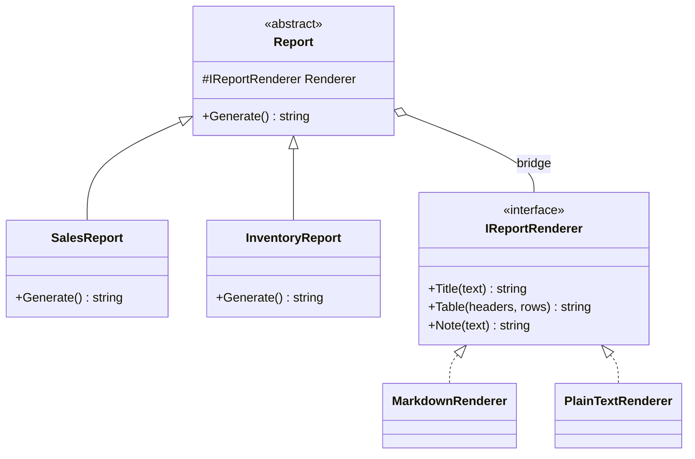

# 🌉 Bridge Pattern – Reports and Output Formats Example (C#)

This example demonstrates the **Bridge Pattern** in C#.  
A reporting module has **two independent dimensions**: the *type of report* (sales, inventory) and the *output format* (Markdown, plain text). The Bridge keeps them in two separate hierarchies that are combined at runtime.

---

## 💡 Intent

> Decouple an abstraction from its implementation so that the two can vary independently.

Without the Bridge, every combination needs its own class: `SalesMarkdownReport`, `SalesPlainTextReport`, `InventoryMarkdownReport`, `InventoryPlainTextReport`...  
With N report types and M formats that's **N × M classes**. With the Bridge it's **N + M**: adding an HTML format means writing one renderer, not one class per report.

---

## 🧠 Key Concepts in This Example

| Role                   | Class                                  | Responsibility                                                  |
|------------------------|----------------------------------------|-----------------------------------------------------------------|
| Abstraction            | `Report`                               | Holds a reference to the renderer and defines `Generate()`      |
| Refined Abstraction    | `SalesReport`, `InventoryReport`       | Decide *what* the report contains and how to compose it         |
| Implementor            | `IReportRenderer`                      | Declares low-level formatting primitives: title, table, note    |
| Concrete Implementor   | `MarkdownRenderer`, `PlainTextRenderer`| Decide *how* each primitive is written                          |
| Client                 | `Program.cs`                           | Combines any report with any renderer                           |

---

## 🗺️ UML Diagram



The two hierarchies are connected only by the `Renderer` reference held by `Report`: that reference is the *bridge*. Each side can grow without touching the other.

---

## 🧪 Example Use Case

Each report uses the renderer's primitives in its own way:

- `SalesReport` writes a title, a table of sales and **one note** with the total revenue.
- `InventoryReport` writes a title, a table of stock levels and **one note for each product to reorder**.

The renderers know nothing about sales or stock: they only know how to write a title, a table or a note in their format.
This is the key difference between the two sides: the **implementor offers primitive operations**, the **abstraction builds higher-level logic** on top of them.

---

## 📦 Example Execution

```csharp
var markdown = new MarkdownRenderer();
var plainText = new PlainTextRenderer();

Report[] reports =
[
    new SalesReport(markdown, sales),
    new SalesReport(plainText, sales),
    new InventoryReport(plainText, stock)
];

foreach (var report in reports)
{
    Console.WriteLine(report.Generate());
}
```

Output:

```
# Monthly sales

| Product | Qty | Unit price | Total |
|---|---|---|---|
| Laptop | 3 | 899.00 | 2697.00 |
| Monitor | 5 | 179.90 | 899.50 |
| Keyboard | 12 | 49.50 | 594.00 |

> Revenue: 4190.50 EUR

MONTHLY SALES
=============

Product   Qty  Unit price  Total
--------  ---  ----------  -------
Laptop    3    899.00      2697.00
Monitor   5    179.90      899.50
Keyboard  12   49.50       594.00

NOTE: Revenue: 4190.50 EUR

INVENTORY STATUS
================

Product   In stock  Reorder level
--------  --------  -------------
Laptop    4         5
Monitor   20        8
Keyboard  2         10

NOTE: Reorder Laptop (4 left)
NOTE: Reorder Keyboard (2 left)
```

## ✅ Benefits

| Feature                             | Benefit                                                          |
| ----------------------------------- | ---------------------------------------------------------------- |
| 📉 No class explosion                | N + M classes instead of N × M                                   |
| 🔀 Independent evolution             | New reports and new formats are added without touching each other |
| 🔁 Runtime combination               | The renderer is chosen when the report is created                 |
| 🧪 Improves testability              | Reports can be tested with a fake renderer                        |

## ⚠️ Notes

- **Design the implementor around primitives**, not around the abstraction. If `IReportRenderer` had a `RenderSalesReport()` method, every new report would force changes to every renderer, and the bridge would be lost.
- **Bridge vs Strategy**: the structure is the same (an object delegating to an interface). The difference is the intent: Strategy swaps *one algorithm*, while Bridge separates *two hierarchies* that both grow over time.
- Bridge is usually **designed up front**, when you already see two dimensions of variation. Adapter is typically applied *afterwards*, to make existing incompatible classes work together.

## 🔄 Alternatives & Related Patterns

- **[Adapter](../Adapter/README.md)** makes an existing class fit an interface; Bridge separates abstraction and implementation by design.
- **[Abstract Factory](../../Creational/AbstractFactory/README.md)** can create the right renderer for the current context and hide which implementor is used.
- **Strategy** has the same structure but a different intent (see the notes above).
