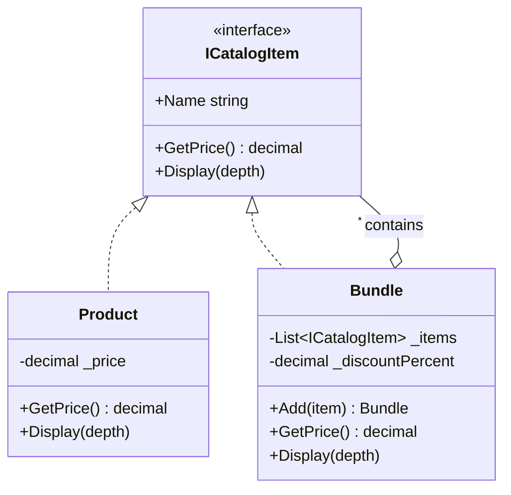

# 🌳 Composite Pattern – Product Bundles Example (C#)

This example demonstrates the **Composite Pattern** in C#.  
An e-commerce catalog sells **single products** and **bundles**. A bundle can contain products or other bundles, each with its own discount, and the cart calculates the total without knowing which is which.

---

## 💡 Intent

> Compose objects into tree structures to represent part-whole hierarchies. Composite lets clients treat individual objects and compositions of objects uniformly.

Use it when your data is naturally a **tree** (bundles, folders and files, menus, org charts) and you want to run the same operation on a single element or on a whole branch.

---

## 🧠 Key Concepts in This Example

| Role      | Class          | Responsibility                                                     |
|-----------|----------------|--------------------------------------------------------------------|
| Component | `ICatalogItem` | Common interface for products and bundles: `GetPrice()`, `Display()` |
| Leaf      | `Product`      | A single product: returns its own price, has no children           |
| Composite | `Bundle`       | Holds children and delegates operations to them recursively        |
| Client    | `Program.cs`   | Works only with `ICatalogItem`, e.g. to calculate the cart total   |

---

## 🗺️ UML Diagram



The key is the relation from `Bundle` back to `ICatalogItem`: a bundle contains *components*, so it can hold both products and other bundles. That's what creates the tree.

---

## 🧪 Example Use Case

The cart contains a cable and a "Home office kit". The kit contains another bundle:

```
Cart
├── USB-C cable                12.90
└── Home office kit (-5%)
    ├── Laptop                899.00
    ├── Monitor               179.90
    └── Peripherals pack (-10%)
        ├── Keyboard           49.50
        └── Mouse              25.00
```

When the cart asks the kit for its price, the kit asks its children, and the "Peripherals pack" asks its own children.
Each bundle applies its discount to the sum it receives: `(49.50 + 25.00) - 10% = 67.05`, then `(899.00 + 179.90 + 67.05) - 5% = 1088.65`.

---

## 📦 Example Execution

```csharp
var peripheralsPack = new Bundle("Peripherals pack", 10)
    .Add(keyboard)
    .Add(mouse);

var homeOfficeKit = new Bundle("Home office kit", 5)
    .Add(laptop)
    .Add(monitor)
    .Add(peripheralsPack);

// The cart treats single products and bundles in the same way
ICatalogItem[] cart = [cable, homeOfficeKit];

Console.WriteLine("Cart:");
foreach (var item in cart)
    item.Display(1);

var total = cart.Sum(item => item.GetPrice());
Console.WriteLine($"Total: {total:0.00} EUR");

// Cycles are rejected
peripheralsPack.Add(homeOfficeKit);
```

Output:

```
Cart:
  - USB-C cable: 12.90 EUR
  + Home office kit (-5%): 1088.65 EUR
    - Laptop: 899.00 EUR
    - Monitor: 179.90 EUR
    + Peripherals pack (-10%): 67.05 EUR
      - Keyboard: 49.50 EUR
      - Mouse: 25.00 EUR
Total: 1101.55 EUR

Error: 'Home office kit' cannot be added to 'Peripherals pack': it would create a cycle.
```

## ✅ Benefits

| Feature                             | Benefit                                                          |
| ----------------------------------- | ---------------------------------------------------------------- |
| 🎯 Uniform treatment                 | The client never checks `if (item is Bundle)`                    |
| 🌳 Arbitrary depth                   | Bundles can be nested at any level with no extra code            |
| 🧱 Supports Open/Closed Principle    | New item types (e.g. a subscription) only need to implement `ICatalogItem` |
| ✂️ Simple client code                | `cart.Sum(item => item.GetPrice())` works for the whole tree      |

## ⚠️ Notes

- **Transparency vs safety**: `Add()` is declared only on `Bundle`, not on `ICatalogItem`. This is the *safe* version: you can't call `Add()` on a product by mistake. The *transparent* version puts `Add()` in the component interface, so every node looks the same, but leaves must throw an exception. In C# the safe version is usually preferred.
- **Watch out for cycles**: if a bundle ended up inside itself, `GetPrice()` would recurse forever and crash with a `StackOverflowException`, which can't be caught. That's why `Add()` checks the whole subtree first.
- **Deep trees and performance**: every call walks the whole tree. For very large trees you may want to cache results (e.g. the price) and invalidate the cache when a child changes.

## 🔄 Alternatives & Related Patterns

- **[Builder](../../Creational/Builder/README.md)** is useful to create complex composite trees step by step.
- **Decorator** has a similar structure (an object wrapping a component), but wraps *one* object to add behavior, while Composite holds *many* children to build a tree.
- **Iterator** and **Visitor** are often used to traverse a composite or to add new operations without changing its classes.
