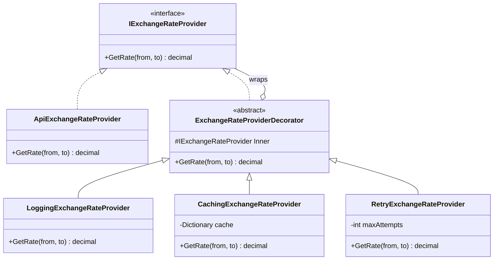

# 🎁 Decorator Pattern – Exchange Rate Service Example (C#)

This example demonstrates the **Decorator Pattern** in C#.  
An exchange rate service calls a remote API that is slow and sometimes fails. Instead of putting caching, retries and logging inside the API class, each feature is a **decorator** that wraps the service and adds one behavior.

---

## 💡 Intent

> Attach additional responsibilities to an object dynamically. Decorators provide a flexible alternative to subclassing for extending functionality.

Use it when you want to add behavior to an object **without changing its class** and **without creating a subclass for every combination** of features (`CachedLoggedRetryingApiProvider`...).

---

## 🧠 Key Concepts in This Example

| Role               | Class                                   | Responsibility                                               |
|--------------------|-----------------------------------------|--------------------------------------------------------------|
| Component          | `IExchangeRateProvider`                 | The interface shared by the real service and the decorators  |
| Concrete Component | `ApiExchangeRateProvider`               | Fetches rates from the (simulated) remote API, nothing else  |
| Base Decorator     | `ExchangeRateProviderDecorator`         | Implements the interface and wraps another provider          |
| Concrete Decorators| `LoggingExchangeRateProvider`, `CachingExchangeRateProvider`, `RetryExchangeRateProvider` | Each adds one behavior before or after calling the wrapped provider |
| Client             | `Program.cs`                            | Uses an `IExchangeRateProvider` without knowing how many layers it has |

---

## 🗺️ UML Diagram



A decorator **is** an `IExchangeRateProvider` and **has** an `IExchangeRateProvider`. That double relation is the whole trick: since what it wraps can be another decorator, layers can be stacked in any number and order.

---

## 🧪 Example Use Case

The decorators are stacked like layers around the real API:

```
Logging → Caching → Retry → API
```

Each call enters from the outside and goes through every layer until one of them answers:

- **Logging** writes every request, including the ones answered by the cache.
- **Caching** returns a rate already requested without going further.
- **Retry** repeats the call if the API times out.
- **API** only fetches the rate.

**The order matters**, because each layer only sees the calls that reach it:

- **Logging is the outermost layer**, so it records every request, including cache hits. If it were placed right around the API, it would log only real API calls (which could be useful to count them).
- **Caching is outside Retry**, so a cached rate is returned immediately and never enters the retry loop. Only successful results get cached, because a failed call throws before reaching `_cache[key] = rate`.

---

## 📦 Example Execution

```csharp
IExchangeRateProvider provider =
    new LoggingExchangeRateProvider(
        new CachingExchangeRateProvider(
            new RetryExchangeRateProvider(
                new ApiExchangeRateProvider(),
                maxAttempts: 3)));

Convert(100m, "EUR", "USD");
Convert(250m, "EUR", "USD");
Convert(80m, "EUR", "GBP");
```

Output (the indentation shows which layer is writing):

```
Converting 100.00 EUR to USD:
 [Log] GetRate(EUR, USD)
    [API] Request #1: EUR/USD
   [Retry] Attempt 1 failed: The rates API did not respond in time. Retrying...
    [API] Request #2: EUR/USD
 [Log] EUR/USD = 1.0842
Result: 108.42 USD

Converting 250.00 EUR to USD:
 [Log] GetRate(EUR, USD)
  [Cache] Hit for EUR/USD
 [Log] EUR/USD = 1.0842
Result: 271.05 USD

Converting 80.00 EUR to GBP:
 [Log] GetRate(EUR, GBP)
    [API] Request #3: EUR/GBP
 [Log] EUR/GBP = 0.8571
Result: 68.57 GBP
```

1. The first request fails, **Retry** repeats it and the second attempt succeeds.
2. The second EUR/USD request is answered by **Caching**: the API is not called.
3. EUR/GBP is not cached yet, so it reaches the API.

## ✅ Benefits

| Feature                            | Benefit                                                          |
| ---------------------------------- | ---------------------------------------------------------------- |
| 🧩 Single responsibility            | Each class does one thing: fetch, cache, retry or log            |
| 🔀 Combine features freely          | Any subset, in any order, without a subclass for each combination |
| 🧱 Supports Open/Closed Principle   | New behaviors (e.g. rate limiting) are new decorators            |
| 🔁 Decided at runtime               | Layers can be added or removed through configuration             |

## ⚠️ Notes

- **The base decorator is optional.** `ExchangeRateProviderDecorator` avoids repeating the `Inner` field and the constructor. With interfaces that have many methods it's even more useful, because it forwards by default all the methods a decorator doesn't need to change.
- **.NET uses it everywhere.** `Stream` is the classic example: `new GZipStream(new BufferedStream(new FileStream(...)))`. In ASP.NET Core, `DelegatingHandler` lets you build `HttpClient` pipelines with the same idea.
- **With Dependency Injection** decorators are usually registered in the container (e.g. with the Scrutor library's `Decorate<TInterface, TDecorator>()`), so the client receives the whole chain already built.
- In a real application the cache would need an **expiration** (rates change), and retries would wait between attempts. Libraries like **Polly** provide production-ready retry policies.

## 🔄 Alternatives & Related Patterns

- **[Adapter](../Adapter/README.md)** *changes* the interface of an object; Decorator *keeps* it and adds behavior.
- **[Composite](../Composite/README.md)** has a similar structure, but a composite holds *many* children to build a tree, while a decorator wraps *exactly one* object.
- **Proxy** also wraps an object with the same interface, but to *control access* to it (lazy loading, permissions, remote calls) rather than to add features.
- **Chain of Responsibility** looks similar too, but its handlers are meant to *find the one* that handles the request, while decorators are meant to *add behavior* at every layer. A decorator can still stop the call when that is its job, like the cache does on a hit.
