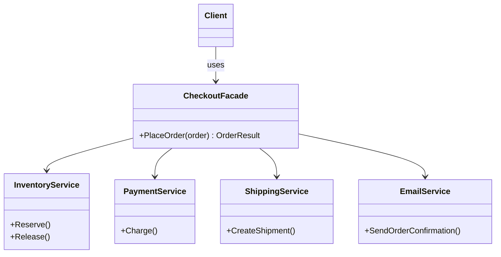

# 🏛️ Facade Pattern – E-commerce Checkout Example (C#)

This example demonstrates the **Facade Pattern** in C#.  
Placing an order in an e-commerce involves four subsystems: inventory, payment, shipping and email. The **`CheckoutFacade`** hides them behind a single method, `PlaceOrder()`, which calls them in the right order and undoes the previous steps when one fails.

---

## 💡 Intent

> Provide a unified interface to a set of interfaces in a subsystem. Facade defines a higher-level interface that makes the subsystem easier to use.

Use it when a common task requires coordinating several classes, and you don't want every client (a web controller, a mobile API, a batch job...) to repeat that coordination.

---

## 🧠 Key Concepts in This Example

| Role       | Class                                                          | Responsibility                                            |
|------------|----------------------------------------------------------------|-----------------------------------------------------------|
| Facade     | `CheckoutFacade`                                               | Exposes `PlaceOrder()` and coordinates the subsystems      |
| Subsystems | `InventoryService`, `PaymentService`, `ShippingService`, `EmailService` | Each does its own job and knows nothing about the facade |
| Client     | `Program.cs`                                                   | Places orders with one call                               |

---

## 🗺️ UML Diagram



The client depends only on the facade. The subsystems don't know the facade exists: they can still be used directly when needed.

---

## 🧪 Example Use Case

Without the facade, every client that places an order must know this sequence and its error handling:

1. **Reserve** the items in the inventory. If they are not available, stop.
2. **Charge** the customer. If the payment is declined, **release** the reserved items and stop.
3. **Create the shipment** and get the tracking number.
4. **Send the confirmation** email with the tracking number.

The second step is the important one: forgetting to release the items after a failed payment would leave them blocked forever. With the facade this logic is written **once**, in `PlaceOrder()`.

---

## 📦 Example Execution

```csharp
var checkout = new CheckoutFacade(new InventoryService(), new PaymentService(), new ShippingService(), new EmailService());

foreach (var order in orders)
{
    Console.WriteLine($"Placing order {order.Id}:");
    var result = checkout.PlaceOrder(order);
    Console.WriteLine($"{(result.IsSuccess ? "OK" : "FAILED")}: {result.Message}");
    Console.WriteLine();
}
```

Output:

```
Placing order ORD-1:
  [Inventory] Reserved 1 x LAPTOP-15 (4 left)
  [Payment] Charged 899.00 EUR (PAY-7001)
  [Shipping] Shipment TRK-0001 for order ORD-1 to Via Roma 1, Milano
  [Email] Confirmation for order ORD-1 sent to mario.rossi@example.com (tracking TRK-0001)
OK: Order completed (payment PAY-7001, tracking TRK-0001)

Placing order ORD-2:
  [Inventory] Reserved 2 x LAPTOP-15 (2 left)
  [Payment] Card declined
  [Inventory] Released 2 x LAPTOP-15 (4 left)
FAILED: Payment declined

Placing order ORD-3:
  [Inventory] Not enough stock for MONITOR-27
FAILED: Product out of stock
```

- **ORD-1** goes through all four subsystems.
- **ORD-2** is declined, and the facade gives the two laptops back to the inventory.
- **ORD-3** stops at the first step: the payment is never attempted.

## ✅ Benefits

| Feature                           | Benefit                                                           |
| --------------------------------- | ----------------------------------------------------------------- |
| 🎯 Simple API                      | One method instead of four services and their sequence            |
| 🧩 Logic in one place              | The order of the steps and the compensation are not duplicated    |
| 🔗 Loose coupling                  | Clients depend on the facade, not on every subsystem              |
| 🔧 Subsystems can change           | E.g. a new payment provider only affects the facade               |

## ⚠️ Notes

- **A facade doesn't hide the subsystems by force.** Clients that need more control (e.g. an admin tool that releases stock manually) can still use `InventoryService` directly.
- **Avoid the "god object".** If the facade starts collecting unrelated methods (`PlaceOrder`, `ExportReport`, `ResetPassword`...), split it into several facades, one per use case.
- In real applications this is often called an **application service** or **use case** class, and the compensation steps of a distributed transaction are known as the **Saga** pattern.

## 🔄 Alternatives & Related Patterns

- **[Adapter](../Adapter/README.md)** wraps *one* class to change its interface; Facade wraps *many* classes to simplify their use.
- **Mediator** also centralizes coordination, but the colleagues know the mediator and talk through it, while subsystems don't know the facade exists.
- A facade is often implemented as a **[Singleton](../../Creational/Singleton.Basic/README.md)**, or registered as a single instance in the Dependency Injection container.
