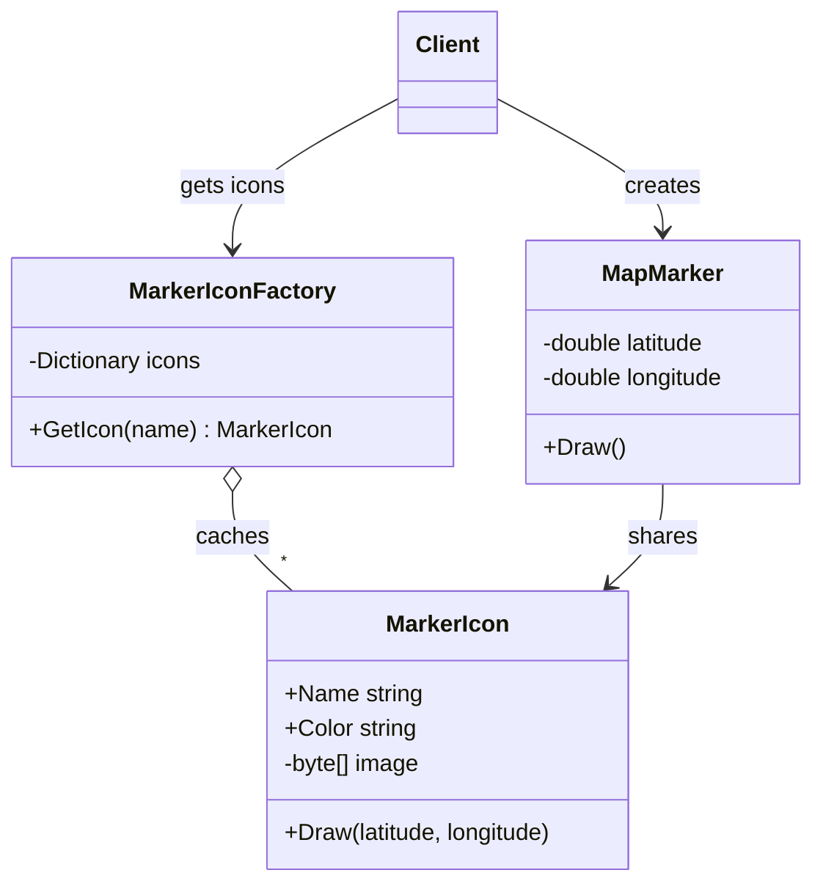

# 🪶 Flyweight Pattern – Delivery Map Markers Example (C#)

This example demonstrates the **Flyweight Pattern** in C#.  
A logistics app shows **10,000 markers** on a map (warehouses, stores, delivery points). Each marker has its own position, but there are only **3 different icons**, each a 20 KB image. With the Flyweight, the markers share the icons instead of each one loading its own copy.

---

## 💡 Intent

> Use sharing to support large numbers of fine-grained objects efficiently.

Use it when an application creates **a huge number of similar objects** and most of their data is the same. The shared part is stored once and referenced by everyone, while each object keeps only what makes it unique.

---

## 🧠 Key Concepts in This Example

| Role              | Class               | Responsibility                                                   |
|-------------------|---------------------|------------------------------------------------------------------|
| Flyweight         | `MarkerIcon`        | Holds the shared, immutable data: name, color, image             |
| Flyweight Factory | `MarkerIconFactory` | Creates each icon once and returns the same instance afterwards  |
| Context           | `MapMarker`         | One per point: stores its position and a reference to the icon   |
| Client            | `Program.cs`        | Creates the markers, always getting icons from the factory       |

The data is split in two:

| State                  | Where it lives | Example                  | Shared? |
|------------------------|----------------|--------------------------|---------|
| **Intrinsic** state    | `MarkerIcon`   | name, color, 20 KB image | ✅ yes   |
| **Extrinsic** state    | `MapMarker`    | latitude, longitude      | ❌ no, unique per marker |

---

## 🗺️ UML Diagram



Many `MapMarker` objects point to the same `MarkerIcon`. The icon doesn't store the position: the marker passes it to `Draw(latitude, longitude)` every time.

---

## 🧪 Example Use Case

Without the Flyweight, each marker would hold its own copy of the image:

```
10,000 markers × 20 KB = 195.3 MB
```

With the Flyweight, the images are loaded only once per type:

```
3 icons × 20 KB = 60 KB
```

The markers still exist as 10,000 objects, but each one is small: two `double` values and a reference.

---

## 📦 Example Execution

```csharp
var factory = new MarkerIconFactory();

for (var i = 0; i < markerCount; i++)
{
    var latitude = 45.40 + (i % 100) * 0.002;
    var longitude = 9.10 + (i / 100) * 0.002;

    var icon = factory.GetIcon(iconTypes[i % iconTypes.Length]);
    markers.Add(new MapMarker(latitude, longitude, icon));
}

foreach (var marker in markers.Take(4))
    marker.Draw();
```

Output:

```
Creating 10,000 markers:
  [Factory] Loading icon 'warehouse' from disk
  [Factory] Loading icon 'store' from disk
  [Factory] Loading icon 'delivery' from disk

Drawing the first markers:
  Drawing 'warehouse' icon (blue, 20 KB) at 45.400, 9.100
  Drawing 'store' icon (green, 20 KB) at 45.402, 9.100
  Drawing 'delivery' icon (red, 20 KB) at 45.404, 9.100
  Drawing 'warehouse' icon (blue, 20 KB) at 45.406, 9.100

Markers: 10,000, icons in memory: 3
Icon memory without Flyweight: 195.3 MB
Icon memory with Flyweight:    60 KB
```

The factory loads each icon only once, even though `GetIcon()` is called 10,000 times.

## ✅ Benefits

| Feature                       | Benefit                                                          |
| ----------------------------- | ---------------------------------------------------------------- |
| 💾 Less memory                 | Heavy data is stored once instead of once per object             |
| ⚡ Less loading work           | Each icon is read from disk only the first time                  |
| 📈 Scales with object count    | Memory grows with the number of *icon types*, not of markers    |

## ⚠️ Notes

- **Flyweights must be immutable.** If one marker could change the color of its icon, *every* marker sharing it would change too. That's why `MarkerIcon` has no setters.
- **Only use it when it pays off.** The pattern adds a factory and splits the data in two. It's worth it only with many objects *and* a large shared part; for a few hundred objects it's usually premature optimization.
- **Thread safety**: if markers are created from several threads, the factory needs a `ConcurrentDictionary` (e.g. with `GetOrAdd`) instead of a `Dictionary`.
- **.NET already uses this idea**: string interning (`string.Intern`) shares identical strings, and `ArrayPool<T>` reuses buffers instead of allocating new ones.

## 🔄 Alternatives & Related Patterns

- **[Singleton](../../Creational/Singleton.Basic/README.md)** has *one* shared instance of a class; Flyweight has *one shared instance per key* (one per icon type).
- **[Composite](../Composite/README.md)** trees often share their leaves as flyweights, e.g. the characters of a text document.
- **[Prototype](../../Creational/Prototype/README.md)** does the opposite: it *copies* objects to make them independent, while Flyweight *shares* them.
