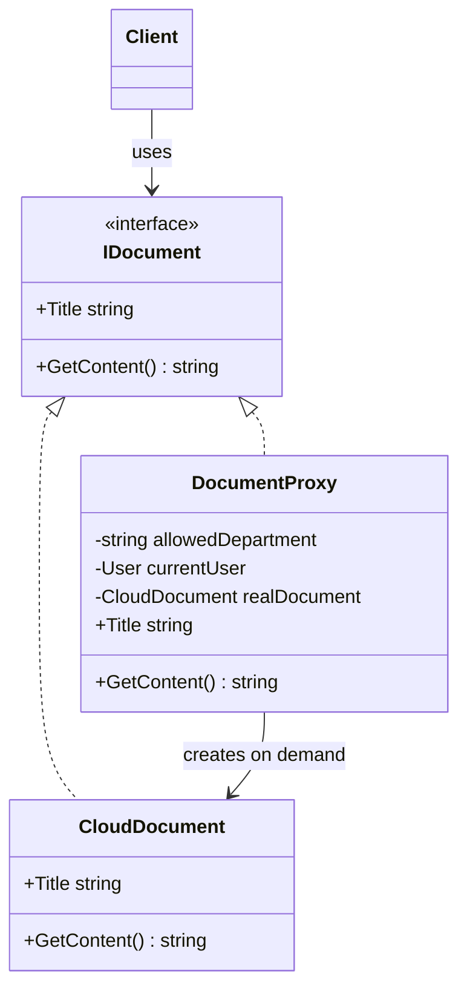

# 🛡️ Proxy Pattern – Cloud Documents Example (C#)

This example demonstrates the **Proxy Pattern** in C#.  
A document management app lists files stored in the cloud. Downloading a file is slow, and some files are reserved to a department. A **`DocumentProxy`** stands in for each real document: it downloads the file only when someone opens it, and only if the user is allowed to.

---

## 💡 Intent

> Provide a surrogate or placeholder for another object to control access to it.

Use it when you need to put some logic *between* the client and an object (delaying its creation, checking permissions, calling it remotely, caching its results) without the client noticing.

---

## 🧠 Key Concepts in This Example

| Role         | Class           | Responsibility                                                  |
|--------------|-----------------|-----------------------------------------------------------------|
| Subject      | `IDocument`     | The interface shared by the real document and the proxy         |
| Real Subject | `CloudDocument` | The actual document: creating it downloads the file             |
| Proxy        | `DocumentProxy` | Checks permissions and creates the real document only when needed |
| Client       | `Program.cs`    | Works with `IDocument` and doesn't know it's using proxies      |

---

## 🗺️ UML Diagram



The proxy implements the same interface as the real document and holds a reference to it. Unlike a decorator, the proxy **creates and manages** the real object itself: the client never sees it.

---

## 🧪 Example Use Case

The proxy combines two common kinds of proxy:

| Kind                 | What it does here                                                                 |
|----------------------|-----------------------------------------------------------------------------------|
| **Virtual proxy**    | `Title` is answered from cheap metadata. The file is downloaded only on the first `GetContent()` call, then reused. |
| **Protection proxy** | `GetContent()` first checks the user's department. If access is denied, nothing is downloaded. |

So listing 100 documents costs nothing, and a user without permission can't even trigger the download.

---

## 📦 Example Execution

```csharp
var currentUser = new User("Anna", "Sales");

IDocument[] documents =
[
    new DocumentProxy("sales-q3-2026.pdf", "Sales report Q3", "Sales", currentUser),
    new DocumentProxy("price-list-2026.xlsx", "Price list 2026", "Sales", currentUser),
    new DocumentProxy("payroll-2026-09.pdf", "Payroll September", "HR", currentUser)
];

foreach (var document in documents)
    Console.WriteLine($"  - {document.Title}");

documents[0].GetContent();   // downloads the file
documents[0].GetContent();   // reuses it
documents[2].GetContent();   // access denied
```

Output:

```
Documents:
  - Sales report Q3
  - Price list 2026
  - Payroll September

Opening 'Sales report Q3':
  [Storage] Downloading 'sales-q3-2026.pdf' from the cloud...
  <content of sales-q3-2026.pdf>
Opening 'Sales report Q3' again:
  <content of sales-q3-2026.pdf>

Opening 'Payroll September':
  Access denied: Anna (Sales) cannot open 'Payroll September': reserved to HR.
```

1. Listing the titles doesn't download anything.
2. The first `GetContent()` downloads the file, the second one reuses it.
3. The payroll is reserved to HR, so the proxy stops the request before any download.

## ✅ Benefits

| Feature                          | Benefit                                                           |
| -------------------------------- | ----------------------------------------------------------------- |
| ⏳ Lazy creation                  | Expensive objects are created only if and when they are used     |
| 🔒 Access control                 | Permission checks live in one place, in front of the real object |
| 🙈 Transparent to the client      | The client uses `IDocument` and doesn't change                   |
| 🧩 Single responsibility          | `CloudDocument` only deals with content, not with permissions    |

## ⚠️ Notes

- **Other kinds of proxy**: a *remote proxy* hides a network call behind a local object (e.g. the client classes generated for gRPC or WCF services), a *caching proxy* stores the results of expensive calls, a *logging proxy* records every access.
- **.NET uses proxies a lot**: `Lazy<T>` is a ready-made virtual proxy, Entity Framework Core can create *lazy-loading proxies* for navigation properties, and mocking libraries like Moq generate proxies at runtime with `DispatchProxy` or Castle DynamicProxy.
- **Thread safety**: `_realDocument ??= ...` isn't thread-safe. If the proxy is shared between threads, use `Lazy<CloudDocument>` to make sure the file is downloaded only once.

## 🔄 Alternatives & Related Patterns

- **[Decorator](../Decorator/README.md)** has the same structure, but its goal is to *add behavior* and the client builds the chain. A proxy *controls access* and usually manages the real object's lifecycle by itself.
- **[Adapter](../Adapter/README.md)** gives the wrapped object a *different* interface; a proxy keeps the *same* one.
- **[Facade](../Facade/README.md)** simplifies a whole subsystem; a proxy stands in for a single object.
